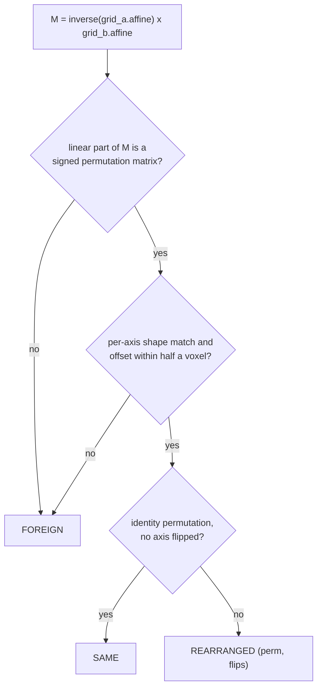

# Segmentation Grid Workflows

Lifecycle, decision guide, and design rationale for voxel-grid handling in
`clarinet/services/image/` and `clarinet/services/slicer/`. This is the narrative
layer: [`docs/image-service.md`](./image-service.md) stays the per-method behavioral
reference (read/write tables, set-operation semantics, HU correction, ...) and
[`clarinet/docs/migration-orientation-0.10.17.md`](../clarinet/docs/migration-orientation-0.10.17.md)
stays the operational remediation guide — this document explains the grid model
itself, when a mismatch can silently happen, which primitive to reach for, and
*why* the framework is built the way it is, so the reasoning survives independently
of the change that produced it.

## Purpose and audience

For framework developers extending image/Slicer code, and for downstream project
authors writing repair or migration scripts against segmentation files. The
recurring failure this document exists to prevent: two images or segmentations
that look aligned in a viewer are compared **by voxel index** (a set operation, an
overlay, a Slicer export) while sitting on physically-equivalent but
index-reversed or index-transposed grids — every voxel test then silently reads
zero overlap, with no exception raised, because the code never checked.

---

## The grid model

**Internal convention is always LPS** (DICOM-native: Left, Posterior, Superior).
NIfTI is RAS on disk — converted at the read/write boundary
(`_LPS_TO_RAS`/`_LAS_TO_LPS`, `clarinet/services/image/image.py:27-29`). NRRD honors
its own `space` header field: LPS passes through as-is, RAS/LAS are converted, and
anything else raises `ImageReadError` (`_nrrd_space_to_lps`,
`clarinet/services/image/image.py:36`) — Slicer itself always writes LPS (Probe P6
below), so this only affects third-party NRRD files.

**The voxel-to-physical affine** (`affine_4x4`) is a 4×4 matrix: the 3×3 linear
part is `direction` scaled per-column by `spacing` (each `direction` column is a
unit vector for that array axis), and the translation column is `origin`.
`Image.affine_4x4` (`clarinet/services/image/image.py:316`) and
`Grid.from_components` (`clarinet/services/image/grid.py:85`) build this matrix by
the identical formula — the two are meant to be interchangeable representations of
the same grid.

**Determinant / handedness.** The sign of the 3×3 linear part's determinant is the
grid's handedness: `det > 0` is right-handed, `det < 0` is left-handed. A
left-handed grid is not invalid — it is a legal voxel-to-physical mapping — but it
is the condition ITK viewers (including Slicer) silently "fix" at load time by
flipping the slice axis (Probe P1). This determinant is the central quantity in
the [design rationale](#design-rationale) below.

**`Grid`** (`clarinet/services/image/grid.py:65`) is the shared value object: a
frozen dataclass `(shape: tuple[int, int, int], affine: np.ndarray)`. Equality is
deliberately left at default object identity (`eq=False`) — a dataclass-generated
`__eq__` would compare `affine` with `==`, and numpy raises on the resulting
array's ambiguous truth value. **Never compare two `Grid`s with `==`; always go
through `grid_relation`.** Derived read-only properties `.origin` / `.spacing` /
`.direction` (`grid.py:114`, `:120`, `:126`) and a diagnostic `.summary()`
(`grid.py:133`) round out the type.

**`RelationKind`** (`clarinet/services/image/grid.py:42`) is the three-way
taxonomy enum: `SAME | REARRANGED | FOREIGN`. **`GridRelation`**
(`clarinet/services/image/grid.py:51`) is the verdict returned by
`grid_relation(a, b, *, atol=1e-4) -> GridRelation` (`grid.py:148`): always a
`.kind`, plus — only when `.kind is RelationKind.REARRANGED` — `.perm` and
`.flips`, the per-axis correspondence between the two grids' index spaces. These
two names are easy to conflate; the enum is `RelationKind`, the verdict object is
`GridRelation`.

**Bundling constraint.** `grid.py` is numpy + stdlib only — **zero framework
imports** (module docstring, `grid.py:1-19`). This is what lets it ship as source
text inside the Slicer correspondence bundle and run standalone in Slicer's
embedded Python, which has neither the framework package nor `pynrrd`/`nibabel` on
its path (Probe P3). See [Design rationale](#design-rationale) for why this
mattered enough to shape the module boundary.

**A tolerance subtlety worth internalizing early:** `grid_relation`'s `SAME`
verdict tolerates translation error up to **half a voxel** (in index-space units,
via `_OFFSET_TOL_VOXELS = 0.5`, `grid.py:39`) — wide enough to absorb on-disk float
rounding, narrow enough that a real one-voxel-or-more misalignment (a mirror, a
transpose) can never be mistaken for identity. `Image.same_grid` /
`Image.assert_same_grid` (`clarinet/services/image/image.py:336`, `:362`) are a
**different, tighter** check: a near-exact `atol`-only (default `1e-4` mm)
comparison of the full affine with **no** permutation tolerance at all, used as
the in-memory pre-overlay guard for two already-loaded objects. The two
deliberately do not share an implementation — see the
[dev-API decision table](#choosing-the-right-primitive) for when each applies.

---

## Grid lifecycle

### DICOM → `volume.nii.gz`

`read_dicom_series` (`clarinet/services/image/dicom_volume.py:21`) wraps
`SimpleITK.ImageSeriesReader` + GDCM. Two facts drive everything downstream:

1. **`ImageOrientationPatient` (IOP) fixes only the in-plane basis** — the row and
   column direction cosines. It does not, by itself, define a right-handed frame
   or fix the through-plane (slice) direction at all. The reader now emits the
   in-plane basis in DICOM's own IOP order end-to-end — array, spacing, and
   direction move together, with no internal row/column swap
   (`dicom_volume.py:68-86`), verified by a save+`read_grid` round-trip test
   (`tests/test_image.py:1130`,
   `test_read_dicom_series_roundtrips_through_save_and_read_grid`).
2. **The slice axis comes from `ImagePositionPatient` (IPP) progression, not
   IOP.** SimpleITK/GDCM can derive an internally-inconsistent slice-axis sign on
   some real series; `ground_truth_slice_geometry`
   (`clarinet/services/image/orientation.py:44`) recomputes the slice-axis
   direction and origin directly from the first/last file's IPP (via `pydicom`,
   independent of SimpleITK) — issues #247/#453. `_canonicalize_slice_axis`
   (`dicom_volume.py:102`) then flips the slice axis, when needed, to the
   canonical sense: the side of the IOP normal
   `n = cross(direction[:, 0], direction[:, 1])` (`dicom_volume.py:164`). Since
   `det([row, col, slice]) = n · slice_dir`, this makes the emitted determinant
   **positive for every series with a non-degenerate IOP** — a degenerate/near-
   orthogonal normal (`|n| ≈ 0` or `|dot(slice_dir, n)| ≈ 0`, floor
   `_DEGENERATE_NORMAL_EPS = 1e-6`, `dicom_volume.py:14`) falls back to the old
   +dominant-axis rule and logs a warning (`dicom_volume.py:170-176`).

The flip is always **geometry-preserving**: array, origin, and direction reverse
*together*, so every voxel keeps its physical position — a direction-only flip
(mirroring the data through the origin plane) is a different, forbidden operation
(the #247/#453 bug class; see the [design rationale](#design-rationale) and
[traps](#traps) below). `Image.read_dicom_series`
(`clarinet/services/image/image.py:553`) stores the result verbatim;
`Image.save_as` → `_save_nifti` (`image.py:685`, `:715`, LPS→RAS at the write
boundary) writes `volume.nii.gz`. The framework's only production entry point is
the conversion pipeline task
(`clarinet/services/pipeline/tasks/convert_series.py:107,115`), a plain
read-then-save with no positional array/spacing access in between.

### Segmentation ↔ volume grid binding, and the Slicer round-trip

Inside 3D Slicer, a segmentation node's reference geometry is bound to a source
volume **node** at creation/load time
(`SetReferenceImageGeometryParameterFromVolumeNode`) — a property of the *scene*,
not of any on-disk file. This is where the mirror bug this document exists to
explain actually happens:

- `slicer.util.loadVolume` canonicalizes **any** left-handed (`det < 0`) volume at
  load, by flipping the slice axis only — geometry-preserving, physical placement
  exact (Probe P1). A right-handed (`det > 0`) volume loads byte-faithful.
- A segmentation created or painted against a `det < 0`-loaded node inherits the
  **already-flipped** in-scene reference geometry before any painting happens — so
  it exports mirrored relative to the on-disk volume file, even though it looked
  correctly aligned to the user on screen the whole time.
- `export_segmentation(name, output_path, *, conform_to=None)`
  (`clarinet/services/slicer/helper.py:384`) is the write-boundary guard.
  `conform_to=<reference file path>` reads the reference's **on-disk** grid
  (`_read_grid_on_disk`, `helper.py:244` — via `sitk.ImageFileReader`, never a
  loaded node, never `loadVolume` — Probe P2), classifies the segmentation node's
  *current* grid against it: `SAME` exports directly; `REARRANGED` re-grids
  **exactly** onto the reference by index rearrangement on a temporary node
  (`_reindex_segmentation_to_grid`, `helper.py:329`, no interpolation, overlapping
  layers preserved — Probe P5), never mutating the caller's node; `FOREIGN` raises
  `SlicerHelperError` and writes nothing. The written file is then re-read and
  re-classified against the reference — any mismatch (or read failure) deletes it
  and raises, so a bad artifact never survives on disk.

```mermaid
flowchart LR
    DCM["DICOM series"] --> CONV["converter: IOP in-plane order +<br/>canonical IOP-normal slice sense"]
    CONV --> VOL["volume.nii.gz<br/>right-handed, LPS"]
    VOL --> LOAD["Slicer loadVolume"]
    LOAD -->|"right-handed: byte-faithful"| SCENE["scene node grid"]
    LOAD -->|"left-handed: slice axis flipped"| SCENE
    SCENE --> PAINT["paint segmentation"]
    PAINT --> EXPORT["export_segmentation(conform_to=volume)"]
    EXPORT -->|"SAME vs on-disk volume"| WRITE["write as-is"]
    EXPORT -->|"REARRANGED vs on-disk volume"| REGRID["exact re-grid onto<br/>on-disk volume grid"]
    REGRID --> WRITE
    WRITE --> ASSERT["re-read written file,<br/>assert SAME (fail-closed)"]
```

### Why the in-scene guard alone is blind

The load-time check `_assert_segmentation_matches_volume`
(`helper.py:154`, private since this change — see
[design rationale](#design-rationale)) compares the segmentation's in-memory
reference geometry against the in-memory volume node. On a `det < 0` volume both
were flipped **identically** at load, so they agree by construction — the guard
cannot see the mirror at all. It is also fail-open by construction: an unresolved
reference volume skips the check, and a segmentation loaded from disk carries no
recorded reference geometry, so the guard returns early either way. **Only a
disk-level read can catch the mirror** — `assert_same_grid_on_disk`
(`clarinet/services/image/grid_io.py:53`) server-side, `_read_grid_on_disk`
(`helper.py:244`) inside Slicer. `_assert_segmentation_matches_volume` remains,
narrowed, as a best-effort load-time diagnostic (`load_segmentation`) and as the
correspondence-engine set-ops' own pre-regrid check
(`_export_segments_labelmap`) — it is no longer `export_segmentation`'s guard.

---

## Choosing the right primitive

| API | Where | Use when | Notes |
|---|---|---|---|
| `Grid` / `Grid.from_components` | `grid.py:65`, `:85` | You have raw shape/spacing/origin/direction (not a file) and need a value object to classify or summarize | `eq=False` — never `==` two grids |
| `grid_relation(a, b, *, atol=1e-4)` | `grid.py:148` | You want a verdict *and* detail (`perm`/`flips`) to act on; works on any two `Grid`s regardless of source | Never raises — `FOREIGN` is a normal return, not an exception |
| `read_grid(path)` | `clarinet/services/image/grid_io.py:20` | Read a file's grid off disk without loading voxel data; 4-D-safe (a 4-D `.seg.nrrd` dispatches through `LayeredSegmentation`) | Clarinet-side only (imports `Image`/`LayeredSegmentation`) |
| `assert_same_grid_on_disk(path_a, path_b, *, atol=1e-4)` | `grid_io.py:53` | Fail-fast guard at a file load/save boundary — raises `GeometryMismatchError` | Inherits `grid_relation`'s half-voxel offset tolerance on `SAME` |
| `Image.same_grid` / `Image.assert_same_grid` | `image.py:336`, `:362` | In-memory pre-overlay guard on two already-loaded `Image`/`Segmentation` objects | Tight `atol`-only, **no** permutation tolerance — not the same contract as `grid_relation`'s `SAME` |
| `Image.reindex_to(target, *, order=0\|1)` / `Segmentation.reindex_to` (overrides, forces `order=0`) | `image.py:378`, `segmentation.py:352` | Resample one loaded image onto another's grid | `order=0` (nearest) is *exact* for a `REARRANGED` pair — no interpolation blur. `Segmentation.reindex_to` forces `order=0` regardless of the argument (prevents label-value corruption from interpolation) and carries segment metadata onto the new grid; `order=1` on a plain `Image` is for genuine sub-voxel interpolation of continuous data |
| `conform_seg_to_grid(seg_path, grid_path, *, out_path=None, atol=1e-4, allow_resample=False)` | `clarinet/services/image/segmentation.py:673` | File-level repair script primitive (batch remediation, one-time migrations) | `SAME` no-op; `REARRANGED` exact index rearrangement (3-D **and** 4-D layered, label/layer-preserving); `FOREIGN` raises `GeometryMismatchError` unless `allow_resample=True` |
| Set-op `resample=` (`Segmentation.union`/`intersection`/`difference`/`symmetric_difference`/`subtract`/`append`) | `segmentation.py:383` (`_align_other`) | Two in-memory segmentations must be compared index-wise and might legitimately be on different grids | Default `resample=False` raises `GeometryMismatchError`; `True` resamples `other` onto the caller's grid (nearest-neighbour) |
| `export_segmentation(name, output_path, *, conform_to=None)` | `clarinet/services/slicer/helper.py:384` | The write boundary for a segmentation authored/loaded in Slicer | `conform_to=<reference file path>` is the only export guard (see [design rationale](#design-rationale)); requires the correspondence bundle (`include_correspondence=True`) |

For the full per-parameter behavior of any row above (return types, exact
docstring contracts, related methods), see
[`docs/image-service.md`](./image-service.md) and
[`.claude/rules/slicer-helper-api.md`](../.claude/rules/slicer-helper-api.md) —
this table is a map, not a replacement for either.

---

## Relations catalogue

This mirrors `grid_relation`'s actual implementation
(`grid.py:178-211`) exactly: compose `M = inv(a.affine) @ b.affine`, then check
whether `M`'s linear part is a signed permutation (each row/column exactly one
entry ≈ ±1, rest ≈ 0, within `atol`) with every per-axis translation within half a
voxel of its exact target. `REARRANGED` carries `(perm, flips)` — the source axis
feeding each output axis, and whether that mapping is negated — from which
"mirror" and "in-plane transpose" are named special cases, not distinct kinds.

| Relation | Arises | Detect | Repair |
|---|---|---|---|
| **SAME** | Grids are byte-identical (within `atol` on the linear part, half a voxel on translation) — a freshly-converted volume and a segmentation exported through `conform_to`, or any file re-read against itself | `grid_relation(...).kind is RelationKind.SAME`; `Image.same_grid` for the tighter in-memory check | None — no-op by definition |
| **REARRANGED — mirror** (`perm` = identity, one axis flipped — e.g. `flips=(False, False, True)`) | ITK/Slicer's load-time canonicalization of a `det < 0` volume (Probe P1); a legacy pre-#453 conversion vs. a re-converted one whose slice-sense anchor now disagrees (a negative-dominant-IOP-normal series under the canonical-sense rule) | `grid_relation` returns `REARRANGED` with `perm == (0, 1, 2)` and exactly one `True` in `flips`; `is_volume_misoriented(volume_nifti, dicom_dir)` (`orientation.py:151`) for the DICOM-ground-truth-specific case | `Image.reindex_to(order=0)` / `conform_seg_to_grid` (exact, idempotent) server-side; `export_segmentation(conform_to=)` at the Slicer write boundary |
| **REARRANGED — in-plane transpose** (`perm` swaps two in-plane axes, e.g. `(1, 0, 2)`, no flips) | The DICOM→NIfTI conversion epoch itself (dropping the internal row/column swap) — every legacy segmentation compared against a re-converted volume of the same series | Same predicate: `grid_relation` returns `REARRANGED` with a non-identity `perm` | Identical repair primitives — still an exact signed-permutation, so `reindex_to(order=0)` loses nothing |
| **FOREIGN** | A genuinely different study/series, a real rotation, a sub-voxel shift, or a shape mismatch — anything that is not an exact per-axis index correspondence | `grid_relation(...).kind is RelationKind.FOREIGN` | **Not automatic.** `conform_seg_to_grid(..., allow_resample=True)` opts into a true (approximate) nearest-neighbour resample only once a human has confirmed the pairing is intentional; every other primitive in this document raises by default |

---

## Design rationale

### Why a value object, an enum, and a signed-permutation predicate — not three strings

The affine-composition formula used to exist independently in roughly five places
(`affine_4x4`, `_save_nifti`, `_save_nrrd`, the grid-summary formatter, and the
then-planned 4-D branch), and grid comparison was either an anonymous
`(shape, affine)` tuple or a boolean `same_grid`. An earlier design used a
three-string vocabulary (`"same"`/`"mirrored"`/`"other"`), which could not express
the in-plane transpose — and the DICOM→NIfTI conversion epoch (below) **itself
mass-produces** that exact relation for every legacy segmentation against its
re-converted volume, so "other must fail" directly contradicted the plan's own
migration step ("conform legacy pairs"). A bespoke axis-aligned mirror predicate
(matching only a `z₀ + (n−1)·spacing`-style flip) was also unsafe for an oblique
acquisition. The signed-permutation form (`grid_relation`, `grid.py:148`) handles
oblique grids automatically — it operates purely on the index-space transform
`M = inv(a.affine) @ b.affine`, never on world-axis labels — and gives the
half-voxel tolerance a principled meaning: the widest window that cannot straddle
two neighbouring voxel centers, so `REARRANGED` really does mean "every voxel
center of one grid lands exactly on a voxel center of the other."

### Why the grid core ships as pure numpy/stdlib into both runtimes

`helper.py` cannot `import clarinet` — it ships to Slicer as flattened source
text. Before this change, an equivalent relation predicate would have needed a
second, hand-rolled implementation inside Slicer, which is exactly how verdicts
drift between the two runtimes (the same failure class an earlier change had to
eliminate for the correspondence engine's set operations). Probes P2-P4
(below) confirmed a pure-numpy module is not just possible but *sufficient*:
SimpleITK is a faithful on-disk grid reader inside Slicer, and Slicer's Python has
neither `pynrrd` nor `nibabel`, so `grid.py` — numpy + stdlib only, zero framework
imports (`grid.py:1-19`) — is appended to `correspondence_bundle.py`'s
`_MODULES` tuple (`clarinet/services/slicer/correspondence_bundle.py:19`) and
rides into Slicer alongside the correspondence engine through the same
`include_correspondence=True` opt-in, injected between the helper source and the
script runner (`clarinet/services/slicer/service.py:229`). Inside Slicer,
`_read_grid_on_disk` (`helper.py:244`) is the adapter: `sitk.ImageFileReader` +
`ReadImageInformation()` (metadata-only — no voxel data touched) built into a
bundled `Grid`.

### Why `conform_to` is the only export guard

The removed `reference_volume=` parameter's fail-open was **structural to its own
shape**, not a fixable bug in its implementation: callers passed
`reference_volume=find_loaded_volume(path)`, and `None` meant both "don't guard"
and "resolution failed" — no implementation can fail closed on a channel that
conflates those two meanings without breaking the volume-resolution helper's own
query contract. `conform_to=<reference file path>` heals this by moving grid
resolution *inside* the enforcement point itself — it reads the reference file
directly, so there is no separate "resolve, then maybe guard" step to fail open
on. Keeping the old parameter alongside the new one would have shipped permanent
API debt (which one wins when both are passed?) for no safety benefit, so it was
removed outright rather than deprecated. Enforcement now lives at the **write**
boundary — the load-time check (`_assert_segmentation_matches_volume`,
`helper.py:154`) stays a best-effort diagnostic by design, not a guarantee.

### Why guarded repair — `conform_seg_to_grid` refuses to guess

An unconditional resampler is unsafe for exactly the artifact class it is most
often run against: a multi-layer `.seg.nrrd` with several overlapping segments,
where a silent resample of a *foreign* mask (wrong study, wrong series) produces a
plausible-looking but physically meaningless result with no error at all. Safe
defaults win over backward compatibility as an established project stance, so
`conform_seg_to_grid` (`segmentation.py:673`) classifies before touching
anything: `SAME` is a no-op, `REARRANGED` repairs by an *exact* index
rearrangement (nearest-neighbour resampling lands precisely on voxel centers for
a signed-permutation transform — no interpolation blur), and `FOREIGN` raises
`GeometryMismatchError` unless the caller explicitly opts in with
`allow_resample=True`. The 4-D layered path
(`_conform_layered_seg`, `segmentation.py:779`) preserves the original NRRD header
verbatim — every `Segment{i}_Name`/`LabelValue`/`Layer`/`Color` and the layer
count — deliberately *not* by round-tripping through
`LayeredSegmentation.from_layers` (`layered_segmentation.py:92`), which forces one
segment per layer at `LabelValue=1` (`layered_segmentation.py:131`) and would
silently drop any other label value or multi-segment-per-layer structure.

### Why the canonical slice sense is the IOP-normal side, not a fixed dominant axis

An earlier design kept the slice-sense anchor fixed to the "+dominant anatomical
axis" and planned to catch the residual left-handed population purely at the
Slicer-export conform step. That model turned out to be wrong on two counts:
existing canonicalization already flipped any series whose slice order opposed
its own physical normal, so the scenario the old design meant to leave uncaught
could never actually occur; and the class that *would* stay left-handed under the
+dominant rule (a series whose IOP normal itself is negative-dominant) is
left-handed only because of an arbitrary choice of anchor, not because of
anything physical about the acquisition. Re-anchoring the canonical sense to the
**side of the IOP normal** — `n = cross(direction[:, 0], direction[:, 1])`,
flipping when `dot(slice_dir, n) < 0` (`dicom_volume.py:160-178`) — is not a new
kind of mirror: `det([row, col, slice]) = n · slice_dir`, so this re-anchoring
makes the emitted determinant **universally positive** for every non-degenerate
series, using exactly the same geometry-preserving index-rearrangement mechanism
the flip already used. The hard invariant this change never violates: **every
emitted-grid transform must be a geometry-preserving index rearrangement** (array,
origin, and direction move together; physical positions are invariant) — forcing
`det > 0` via a *direction-only* flip remains forbidden (that is precisely the
mirror bug from issues #247/#453); forcing it via a geometry-preserving flip is a
grid *representation* choice, consistent with the earlier #412 fix, whose real
invariant was always version-stability plus geometry-preservation of the slice
axis, never the +dominant anchor itself. `is_volume_misoriented`
(`orientation.py:151`) was updated in lockstep: its expected origin is now the IPP
endpoint with the smaller projection onto the raw (unforced) IOP normal, rather
than a head-forced one — identical to the pre-existing rule for the common
head-ward case, opposite only for a negative-dominant-normal series. Confirmed
empirically end-to-end: a right-handed volume round-trips Slicer with zero grid
drift (Probe P6) — no ITK runtime ever canonicalizes it at load, so a *fresh*
segmentation needs no `conform_to` step at all; `conform_to` demotes from "the
only thing standing between a fresh segmentation and a silent mirror" to
defense-in-depth for legacy and third-party files.

### Why enforcement lives at the write boundary, not just at load time

Across every decision above, the same shape recurs: a load-time or in-memory
check can only compare things that were already transformed the same way, so it
agrees by construction on exactly the input that matters (see
["why the in-scene guard alone is blind"](#why-the-in-scene-guard-alone-is-blind)
above). A disk-level read is unaffected by any in-memory canonicalization, so it
is the only check that can see a real mismatch. This is why
`assert_same_grid_on_disk` reads both files fresh from disk rather than accepting
already-loaded objects, why `export_segmentation`'s `conform_to` reads the
reference via `_read_grid_on_disk` and never via a loaded node, and why the
post-write step re-reads the file **Slicer itself just wrote** rather than
trusting the export call succeeded — a freshly-written file is exactly as capable
of silently landing on the wrong grid as any other file on disk.

---

## Probe evidence (live Slicer 5.10.0, 2026-07-22)

Every load-bearing Slicer-side assumption above was probed against a live Slicer
web server rather than assumed from documentation, using synthetic volumes built
directly with SimpleITK (bypassing the framework's own converter, so the probes
are independent of it) and sent through Slicer's `/slicer/exec` HTTP protocol.

**Methodology, by technique:**

- **Synthetic `det < 0` / `det > 0` volumes with marker voxels.** Small (e.g. 6³)
  volumes written directly via `sitk.WriteImage` with an explicit `SetDirection`
  — an in-plane-swap left-handed matrix, a pure slice-flip left-handed matrix
  (`diag(1, 1, -1)`), and a right-handed control — each with a distinct nonzero
  block so orientation is verifiable by voxel position, not just by header
  inspection.
- **Node-vs-file matrices.** After `slicer.util.loadVolume`, the scene node's
  `IJKToRAS` matrix was compared against the same file's on-disk affine (read
  independently via sitk) to determine exactly what, if anything, the loader
  changed.
- **sitk full reads vs. metadata-only reads.** Both `sitk.ReadImage` (loads
  voxels) and `sitk.ImageFileReader.ReadImageInformation()` (header only, the
  technique `_read_grid_on_disk` actually uses) were run against the same
  left-handed files to confirm the metadata-only path is not a lesser-fidelity
  shortcut.
- **`det < 0` reference-geometry export rehearsal.** A hidden reference volume
  built via `slicer.util.addVolumeFromArray(..., ijkToRAS=<det<0 matrix>)`, bound
  to a segmentation via `SetReferenceImageGeometryParameterFromVolumeNode`, then
  written with the native `exportNode` — checking whether the left-handed matrix
  survives the round-trip verbatim or gets silently corrected somewhere in the
  chain.
- **Two-layer (overlapping-segment) preservation.** A two-segment segmentation
  with deliberate voxel overlap, exported through the same rehearsal, checking
  that both segments still occupy separate, correctly-labeled layers on disk
  afterward rather than collapsing into one.
- **Voxel-coincidence check.** For a given pair of exports (e.g. plain vs.
  conformed), each foreground voxel's index was converted to a physical world
  point (`TransformIndexToPhysicalPoint`) and the two point sets compared for
  exact set-equality — proving two index-different files describe the identical
  physical foreground, not merely "the same shape."

| # | Finding (probed, not inferred) |
|---|---|
| P1 | `slicer.util.loadVolume` canonicalizes **any** `det < 0` volume by flipping the **slice axis only** (geometry-preserving: array reversed + origin recomputed), regardless of which axes caused the left-handedness. `det > 0` volumes load byte-faithful — the node's `IJKToRAS` equals the file's on-disk affine exactly. |
| P2 | SimpleITK inside Slicer is a **faithful on-disk grid reader**: both `sitk.ReadImage` and metadata-only `sitk.ImageFileReader.ReadImageInformation()` preserve `det < 0`, origin, and direction (LPS-native) — the technique behind `_read_grid_on_disk`. |
| P3 | Slicer 5.10's embedded Python has **no `pynrrd` and no `nibabel`** (numpy 2.0.2, SciPy, SimpleITK present). Any Slicer-side grid code must be numpy + sitk only — the constraint `grid.py`'s module boundary exists to satisfy. |
| P4 | sitk metadata-reads a 4-D multi-layer `.seg.nrrd` as a 3-D **vector image** (`dim=3`, `components=n_layers`), reporting the spatial grid directly — no 4-D special-casing needed in `_read_grid_on_disk`. |
| P5 | A `det < 0` reference geometry works end-to-end for export: `addVolumeFromArray(ijkToRAS=<det<0>)` keeps the matrix verbatim; `SetReferenceImageGeometryParameterFromVolumeNode` serializes it faithfully; the native `exportNode` writes the `det < 0` grid into `.seg.nrrd` **preserving overlapping layers** (2 layers stayed 2 layers, segment names and label values intact). |
| P6 | Round-trip: a fresh segmentation on a loaded `det < 0` volume exports slice-mirrored relative to the on-disk file (relation `REARRANGED`, `flips` on the slice axis only); a fresh segmentation on a `det > 0` volume exports grid-**identical** with no conform step at all. Slicer writes `.seg.nrrd` with `space: left-posterior-superior`. |

P1 and P6 together are what make the [design rationale](#design-rationale)'s
canonical-sense argument actionable rather than theoretical: P1 explains *why*
the mirror happens (Slicer's own loader), P6 confirms that removing the trigger
(emitting `det > 0` universally) removes the effect end-to-end, with zero grid
drift. P2-P4 are the structural facts that made `_read_grid_on_disk` viable as a
pure sitk adapter in the first place, rather than something requiring a
hand-rolled NRRD/NIfTI header parser inside Slicer.

**Re-checkability.** These are not one-off, throwaway probes — the load-bearing
subset is re-verified by the committed live-Slicer integration suite on every run
against a real Slicer instance, so a future Slicer upgrade that changes any of
this behavior fails loudly instead of silently:

- `tests/integration/test_slicer_helper.py:935`
  (`test_export_segmentation_conform_to_roundtrip`) re-exercises P1, P5, and the
  `REARRANGED` half of P6 — synthetic `det < 0` volume, load, paint an
  overlapping two-segment segmentation, export plain (`REARRANGED`) vs.
  `conform_to` (`SAME`, layers/names/labels preserved, voxels physically
  coincident with the plain export), plus a `FOREIGN` reference that must raise
  and write nothing.
- `tests/integration/test_slicer_helper.py:1264`
  (`test_fresh_seg_on_canonical_volume_exports_same_without_conform`) re-exercises
  the `SAME` half of P6 end-to-end through the real converter: a synthetic DICOM
  series → `Image.read_dicom_series` (the canonical converter, emitting
  `det > 0`) → `save_as` → live Slicer load → fresh paint → plain export (no
  `conform_to`) → must classify `SAME` against the on-disk volume.

P2-P4 are structural implementation assumptions baked into `_read_grid_on_disk`
rather than independently re-probed every run; a Slicer version that broke them
(e.g. by adding 4-D special-casing to `sitk`, or by making `ReadImageInformation`
non-faithful) would surface as a failure in either live test above, since both
route through `_read_grid_on_disk` for every grid read.

---

## Traps

- **IOP defines no `det = +1` frame.** `ImageOrientationPatient` fixes only the
  in-plane row/column directions; the slice axis is never a direct DICOM fact —
  it comes from `ImagePositionPatient` progression (`ground_truth_slice_geometry`,
  `orientation.py:44`) plus the canonical-sense rule. Do not assume a positive
  determinant, or any particular slice-axis sign, from IOP alone.
- **A pre-epoch file carries the in-plane-swap artifact.** Detect it with
  `grid_relation` (classify against a freshly-converted reference) —
  never "fix" it by editing the direction matrix alone. A direction-only edit
  *is* the mirror bug this document is about (see the hard invariant in
  ["why the canonical slice sense..."](#why-the-canonical-slice-sense-is-the-iop-normal-side-not-a-fixed-dominant-axis)
  above) — every repair primitive in this document moves array, origin, and
  direction together.
- **`resample=True` near-threshold verdicts may differ between runtimes.** The
  Slicer-side set-op guards (`subtract_segmentations` and friends,
  [`.claude/rules/slicer-helper-api.md`](../.claude/rules/slicer-helper-api.md))
  re-grid via a native labelmap re-export, while the server-side path uses
  `reindex_to` — both exact for a `REARRANGED` pair, but a resample opt-in
  (`allow_resample=True` / `resample=True`) that lands genuinely near a
  matching threshold can classify a hair differently between the two.
- **`volume.nii.gz` is regenerable; a segmentation is not.** A volume can be
  reconverted at any time (repair, anonymization path migration, a manual
  re-run); a hand-painted segmentation cannot be reproduced the same way. Any
  segmentation painted before or after a conversion-epoch boundary sits on a
  `REARRANGED` grid relative to a freshly-regenerated volume **until
  conformed** — this is why `conform_seg_to_grid`/`conform_to` are ongoing
  primitives, not one-time migration tools.
- **A degenerate-IOP series falls back to the +dominant sense.** When the
  in-plane columns can't yield a reliable normal (`dicom_volume.py:170-176`), or
  the series isn't dominantly axial for `is_volume_misoriented`'s purposes
  (`_AXIAL_DOMINANCE_THRESHOLD = 0.8`, `orientation.py:26`, raising
  `OrientationUnverifiable` rather than guessing), the volume is not guaranteed
  `det > 0` — it remains covered by `conform_to`/`conform_seg_to_grid` like any
  other legacy file.
- **GDCM already sorts ascending along the IOP normal for the overwhelming
  majority of real conversions — so the canonical-sense flip is usually a
  no-op.** Probed directly (not merely inferred): for every fixture tried,
  including a deliberately negative-dominant-normal series, GDCM's own file sort
  already puts `dot(slice_dir, n) > 0` **before any canonicalization runs at
  all** — see `test_negative_dominant_normal_series_already_canonical`
  (`tests/test_image.py:759`). This means the epoch's *visible* on-disk change
  for most real series is almost always just the in-plane transpose (dropping
  the row/column swap), not a slice-order reversal; the slice-sense flip
  condition mostly fires for the degenerate-fallback and hand-constructed/
  synthetic cases exercised directly against `_canonicalize_slice_axis`
  (`tests/test_image.py:948`,
  `test_canonicalize_negative_dominant_normal_flips_when_old_rule_would_not`).
  This is an empirical characteristic of GDCM's current sort implementation, not
  a documented DICOM or ITK contract — treat it as a debugging heuristic
  ("why doesn't this series ever flip anymore?"), not a guarantee that survives
  a future GDCM/SimpleITK version.

---

## Related documentation

- [`docs/image-service.md`](./image-service.md) — per-method behavioral reference
  for `Image`, `Segmentation`, `LayeredSegmentation`, the COCO converter, and the
  DICOM volume reader.
- [`clarinet/docs/migration-orientation-0.10.17.md`](../clarinet/docs/migration-orientation-0.10.17.md)
  — operational guide for detecting and remediating misoriented volumes and
  stale NRRD files in a deployed project, including the conversion-orientation
  epoch whose design rationale this document covers.
- [`.claude/rules/slicer-helper-api.md`](../.claude/rules/slicer-helper-api.md) —
  full `SlicerHelper` API surface and VTK/Slicer pitfalls, including the
  `export_segmentation`/`conform_to` mechanics and pitfall 7 (`loadVolume`
  canonicalization).
