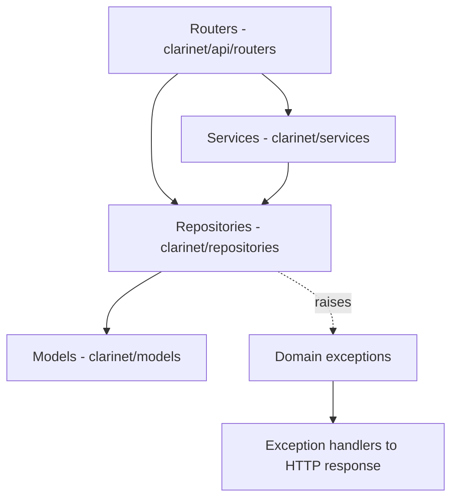

Clarinet is an imaging-centric framework for structured research workflows. A
project declares record types, data schemas and workflow rules; the framework
serves a web application with auto-generated forms, task management, PACS
integration and distributed processing. The backend is FastAPI + SQLModel and
fully async; the SPA is Gleam/Lustre.

## Layers

Calls travel one way. A layer may use the layer below it, never above.

| Layer | Location | Rules |
|---|---|---|
| Routers | `clarinet/api/routers/` | Never query the DB directly. No `try/except` for domain errors — let them propagate. |
| Services | `clarinet/services/` | Business logic, cross-entity orchestration, workflow triggers. Uses repositories. |
| Repositories | `clarinet/repositories/` | The only code that touches the DB session. Raises domain exceptions only. |
| Models | `clarinet/models/` | SQLModel tables + Pydantic DTOs. No path logic, no I/O. |

Dependency injection goes through the `Annotated[X, Depends()]` aliases in
`clarinet/api/dependencies.py` — reuse an existing alias instead of writing a
new `Depends()` wrapper. Writing models and repositories correctly:
[Persistence conventions](/persistence.md).

## Exception flow

Repositories and services raise from `clarinet.exceptions.domain` (root base
`ClarinetError`, ~17 second-tier bases such as `EntityNotFoundError`,
`AuthorizationError`, `ConfigurationError`, `PipelineError`).
`setup_exception_handlers(app)` in `clarinet/api/exception_handlers.py` maps
them onto HTTP responses, so routers need no error handling of their own. The
API layer may also raise the ready-made shortcuts in `clarinet.exceptions.http`
(`NOT_FOUND`, `CONFLICT`, …) — **repositories must never import them**.

## AsyncSession is not concurrency-safe

Every repository in one request shares a single `AsyncSession`, and therefore a
single DB connection, via FastAPI DI.

**Do not use `asyncio.gather()` for several queries on a shared session.** Even
read-only queries deadlock on PostgreSQL: an `asyncpg` connection serves one
query at a time, so concurrent coroutines block each other. SQLite hides the
bug because `aiosqlite` serialises through a dedicated thread.

Use sequential `await` on a shared session. For genuine parallelism, each
coroutine must build its own session from the factory so it draws a separate
connection from the pool. `asyncio.gather()` remains correct for independent
non-session work (HTTP calls, `asyncio.to_thread` CPU work).

## Application lifespan

`lifespan()` in `clarinet/api/app.py` wires the startup sequence. Order matters
— later steps read state the earlier ones populate.

1. **`verify_migrations_applied()`** — a fail-fast gate *before any DB access*.
   The `MigrationError` becomes `StartupError(component="Database")` carrying
   the remediation command for that specific case.
2. `db_manager.create_db_and_tables_async()`, then `add_default_user_roles()`
3. Anchor the plan package: `activate_plan_package()` →
   `_ensure_record_types_imported()` → `compute_fingerprint()` (pins the
   startup snapshot before any later `plan/` edit) → `_load_plan_registries()`.
   See [The clarinet_plan package](/plan-package.md). Must precede step 4 so
   reconciliation can validate validator and hydrator names.
4. `reconcile_config()` → `app.state.config_mode`, `app.state.config_tasks_path`
5. Project file registry → `app.state.project_file_registry`
6. SQL and Quarto report registries → `app.state.report_registry`,
   `app.state.quarto_report_registry`. Custom SQL reports log a warning on
   SQLite, where read-only transactions are unavailable.
7. `ensure_admin_exists()`, the `_check_frontend()` / `_check_ohif()` fail-fast
   checks, then the viewer registry → `app.state.viewer_registry`
8. RecordFlow engine, if `recordflow_enabled` → `app.state.recordflow_engine`
9. Pipeline, if `pipeline_enabled`: `load_task_modules()` → start every
   per-queue broker → `app.state.pipeline_brokers` (plural — one per queue) →
   `sync_pipeline_definitions()`
10. Session cleanup service, if `session_cleanup_enabled`
11. DICOM association semaphore; plus a Storage SCP when `dicom_retrieve_mode`
    is `c-move` or `c-move-study` → `app.state.storage_scp`
12. DICOMweb cache and its cleanup service, if `dicomweb_enabled`; SSE event
    bus, if `sse_enabled`

A `ConfigLoadError` from any plan-loading step becomes
`StartupError(component="Config")` — the server refuses to boot rather than run
without the project's validators, hydrators or flows.

Shutdown (the `finally:` block) is **not** a clean reverse of startup: Storage
SCP → DICOMweb cleanup → flush the DICOMweb cache → session cleanup → every
pipeline broker followed by `reset_brokers()` → RecordFlow client →
`Files.shutdown_io()` → event bus → `db_manager.close()`.

### Lifespan resources must be re-creatable

Several tests invoke `lifespan()` sequentially in one process. A `shutdown()`
that destroys a module-level singleton without replacing it breaks every later
lifespan. Shut the old resource down, then immediately install a fresh one —
`clarinet/files/_fs.py::shutdown_fs_executor` is the reference implementation.

## Entry points

| Surface | Where |
|---|---|
| ASGI app | `clarinet.api.app:app` (module-level `create_app(root_path=settings.root_url)`) |
| CLI | `clarinet.cli.main:main` — argparse; groups `init`, `run`, `db`, `admin`, `worker`, `session`, `rabbitmq`, `ohif`, `quarto`, `agent`, `anon`, `deploy`, `frontend` |
| Worker | `clarinet worker` → `clarinet/services/pipeline/worker.py` — see [Pipeline](/pipeline.md) |
| Settings | `from clarinet.settings import settings`; env vars use the `CLARINET_` prefix, TOML files are `settings.toml` / `settings.custom.toml` |
| Logger | `from clarinet.utils.logger import logger` — never import loguru directly |

Routers carry no `prefix=` of their own; every prefix is assigned by
`include_router` in `clarinet/api/app.py`. The full endpoint table lives in
`.claude/rules/api-urls.md`.

## Frontend

`clarinet/frontend/` is a Gleam + Lustre SPA compiled to a single
`clarinet_frontend.js` bundle, which `scripts/build_frontend.sh` writes into
`clarinet/static/` (a build artifact, gitignored). When `frontend_enabled=True`
the catch-all route serves it and `index.html` out of
`settings.static_directories`. There is no `/static` mount and no `StaticFiles`
anywhere, so the real URL is `{root_url}/clarinet_frontend.js`. Sub-path
deployments work because `index.html` carries `<base href="$BASE_PATH/">`,
substituted server-side from `root_path` — the relative `src` alone would break
on any client-side route deeper than the root.
It follows MVU: every page under `src/pages/` is a self-contained module
exposing `init`/`update`/`view`, and pages never touch global state directly —
they emit `OutMsg` values that `main.gleam` translates into store mutations.
Contract and pitfalls: `clarinet/frontend/CLAUDE.md` plus the three
path-scoped rules `frontend-page-contract.md`, `frontend-routing-forms.md` and
`frontend-reference.md`.
