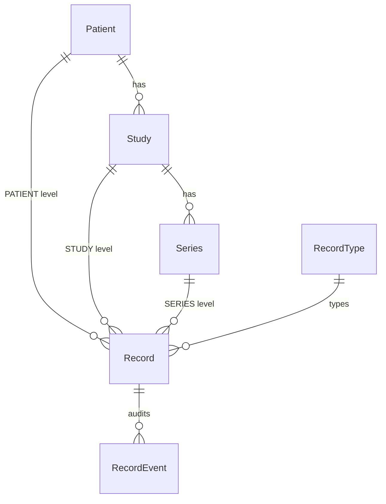
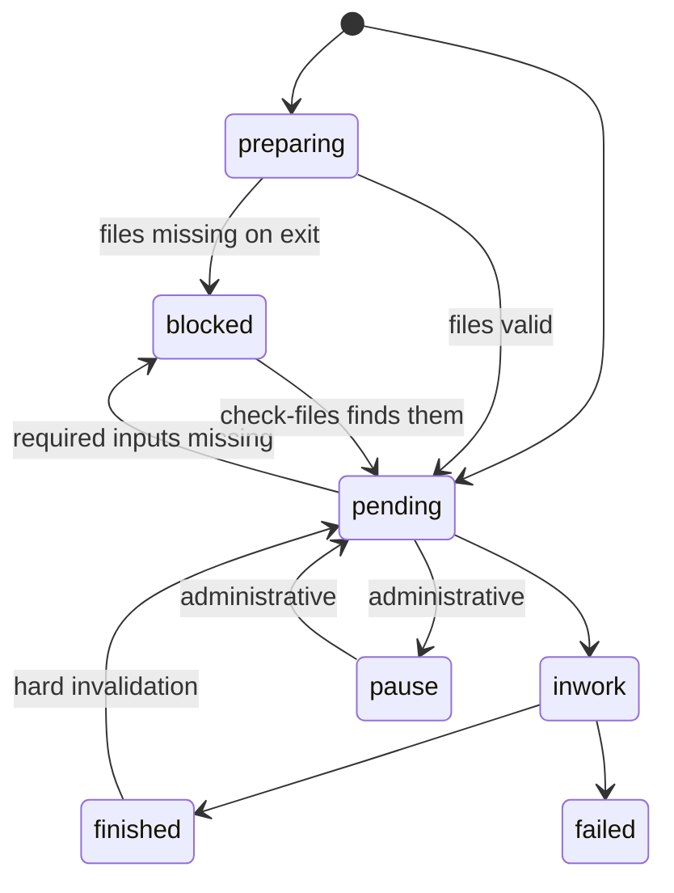

Everything in Clarinet hangs off a four-level hierarchy borrowed from DICOM. A
**Record** is the unit of work: one typed, schema-validated piece of data that
somebody (or some pipeline task) produces about a patient, a study or a series.

Records may additionally form a tree among themselves through
`Record.parent_record_id`, independently of the DICOM hierarchy.

## Levels

| Level | Required | Expected `None` (convention — unenforced) |
|---|---|---|
| `PATIENT` | `patient_id` | `study_uid`, `series_uid` |
| `STUDY` | `patient_id`, `study_uid` | `series_uid` |
| `SERIES` | `patient_id`, `study_uid`, `series_uid` | — |

**Only the "Required" direction is enforced, and the repository does it** —
`RecordRepository.check_constraints` raises `RecordConstraintViolationError`
when a STUDY or SERIES record arrives without `study_uid`, or a SERIES record
without `series_uid`. Nothing rejects a PATIENT-level record that *also* carries
a `study_uid`.

A `@model_validator` of the same shape exists on `Record`
(`clarinet/models/record.py`), but **it never runs**: SQLModel skips Pydantic
validation for `table=True` models, and both creation paths build the row with
`Record(**payload.model_dump())` rather than `Record.model_validate(...)`. Do
not rely on it when adding a new creation path — bulk import, a backfill, a
fixture — put the check in the repository or perform it yourself.

`Patient.auto_id` is a unique non-PK integer, NOT NULL in the DB but typed
`int | None` in Python. `PatientRepository.create()` assigns it from a
monotonic counter (a PG sequence, or the `AutoIdCounter` row on SQLite);
explicit values advance the counter so they cannot collide. A bare
`session.add(Patient(...))` without `auto_id` raises `IntegrityError` at flush —
test code must supply one or use the factories. `Patient.anon_id` is derived
from it as `f"{settings.anon_id_prefix}_{auto_id}"`.

## RecordType

A `RecordType` is the project's declaration of one kind of work. It names the
JSON Schema for the record's data, the role allowed to do it, the files it
consumes and produces, and optional 3D Slicer scripts. Projects declare record
types in TOML or Python — see [The clarinet_plan package](/plan-package.md).

Behavioural flags worth knowing:

| Flag | Effect |
|---|---|
| `unique_by` | uniqueness partition set, a subset of `{"user", "parent"}` (default both). At most one record per partition tuple, scoped within the type's own DICOM level. `None` disables uniqueness; an empty set is rejected |
| `shared_editing` | any role-holder may edit any record of the type; each edit reassigns ownership to the editor. Requires `'user' not in unique_by` |
| `editable` / `edit_window_days` | when false or expired, non-superusers get 409 on mutating a finished record |
| `inherit_user_from_parent` | a created child inherits `user_id` from its `parent_record_id` when no explicit user is given |
| `parent_required` | creation without `parent_record_id` returns 409 `PARENT_REQUIRED` |
| `max_records` | hard cap per DICOM-level context; exceeding it raises `RecordLimitReachedError`. `max_records=0` is the deprecation sentinel — blocks new records while keeping the type registered |
| `min_records` | advisory only — surfaced in admin stats, enforced nowhere |

`unique_by` and `max_records` are **orthogonal**. `max_records` caps how many
records may coexist at a level *in total*, regardless of partition; `unique_by`
only says a given partition tuple holds at most one. So `unique_by={"parent"}`
with `max_records=4` allows four coexisting records, one per distinct parent —
raising the cap does not loosen the per-parent dedup, and narrowing the
partition does not loosen the cap. A plain one-per-level singleton is
`unique_by=None` plus `max_records=1`.

**Bound-tuple rule:** when `"user"` is a selected partition but the candidate
`user_id` is still `None`, the check is skipped — an unassigned record's user
axis is not evaluable yet, so unassigned pools stay creatable. The invariant
closes at claim/assign time, when the same check runs with `user_id` bound. A
type partitioned only by `{"parent"}` has no such gap.

The deprecated `unique_per_user=True/False` kwarg still works in config: it
translates to `{"user"}` / `None`, emits a `DeprecationWarning`, and is ignored
when `unique_by` is also given.

Parent–child links are independent of RecordType: `Record.parent_record_id` is a
self-referencing FK with **`ON DELETE CASCADE`**, so a DB-level delete removes
descendants rather than orphaning them. Parent existence is validated in
`RecordService.create_record()`.

## Status lifecycle

`RecordStatus` has exactly these seven members.

Three statuses mean "not available for work", with distinct exit conditions:

| Status | Why unavailable | Who releases it |
|---|---|---|
| `preparing` | the system is preparing the record (prefill, file/context generation) | flow or pipeline, via an explicit status update |
| `blocked` | prerequisites not met — today that means required input files | automatically, via check-files |
| `pause` | administrative decision | a human |

Contract details that bite:

- `preparing` exists to remove the race between prefill and a concurrent
  check-files call. `check_files` is a no-op for preparing records: no
  auto-unblock, no checksum scan, no file triggers.
- The explicit `preparing → pending` transition re-validates input files
  **before** writing any status. Invalid files land the record in `blocked`, so
  it is never observable as pending-with-invalid-files.
- Direct `preparing → inwork/finished` is rejected with 409 — a preparing record
  must exit through `pending`. Hard invalidation leaves `preparing` untouched.
- Neither `preparing` nor `blocked` records can be assigned or claimed, and
  `find_pending_by_user()` excludes both. Prefill is allowed on both; submit
  returns 409.

`@event.listens_for(Record.status, "set")` stamps `started_at` on `inwork` and
`finished_at` on `finished`.

## Record data vs context_info

`record.data` is the structured, schema-validated payload. Three write paths:

| Method | HTTP | Precondition | Result | Fires |
|---|---|---|---|---|
| submit | `POST /records/{id}/data` | any status except `blocked`, `preparing`, `finished` — in practice `inwork`, since claiming sets it | `finished`, or `failed` via `?status=failed` | `on_status()` |
| update | `PATCH /records/{id}/data` | finished | finished | `on_data_update()` |
| prefill | `POST`/`PUT`/`PATCH .../data/prefill` | pending / blocked / preparing | status unchanged | nothing |

`record.context_info` is a separate free-form markdown sidecar for
human-readable context — no schema, no triggers, not part of `data`. It is
served pre-sanitised as `context_info_html` (markdown → HTML → `nh3.clean`).
Anything machine-readable belongs in `data`; anything that should drive
behaviour belongs in `status`.

## Files

File definitions are normalised and shared: `FileDefinition` links to
`RecordType` through `RecordTypeFileLink` (carrying `role` — INPUT / OUTPUT /
INTERMEDIATE — and `required`) and to `Record` through `RecordFileLink`
(carrying `filename` and an optional `checksum`). Write through the ORM
relationship `file_links`; read metadata through the `file_registry` DTO.
`RecordRead.files` and `RecordRead.file_checksums` are deprecated.

Turning a definition into a path on disk is a separate concern with its own
safety contract: [Files and anonymization](/files-and-anonymization.md).

## Audit trail

`RecordService` appends a `RecordEvent` row after every mutation and **before**
dispatching RecordFlow, with kinds `created`, `status_changed`,
`data_submitted`, `data_updated`, `assigned`, `unassigned`, `failed`,
`invalidated`, `context_info_updated`, `files_cleared`, `deleted`. The actor is
the current user's UUID, or `None` when the request authenticated with
`X-Internal-Token` (pipeline workers, RecordFlow). `record_event.record_key` is
a denormalised record id with no FK, so a deleted record's history stays
correlatable. Prefill writes are deliberately not audited.

## Access control

`AuthorizedRecordDep` grants read access to superusers and to holders of the
record type's role; `MutableRecordDep` adds mutation for the assigned user or an
unassigned record (and bypasses the owner check when `shared_editing` is set).
Beyond roles, capabilities map roles to features in `settings.toml`
(`[role_capabilities]`); superusers and the built-in `admin` role hold every
capability implicitly. Non-superusers see patient identifiers masked by `mask_records`
(`clarinet/api/masking.py`) — but this is **not** an unconditional guarantee.
Masking is skipped when the patient has no `anon_name`, and when the record
type sets `mask_patient_data=False`, the deliberate opt-out for roles that need
real identifiers (every such access is audit-logged).
