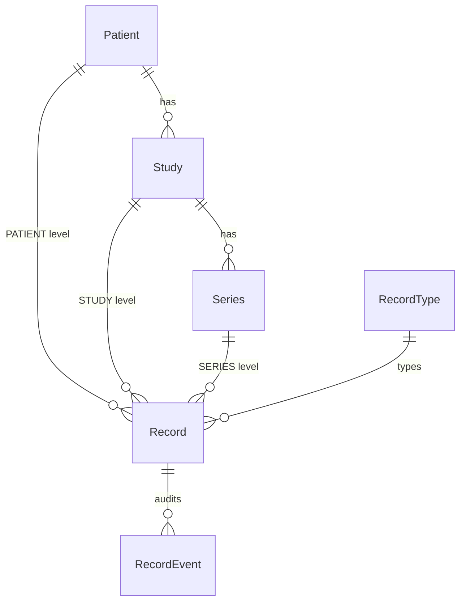
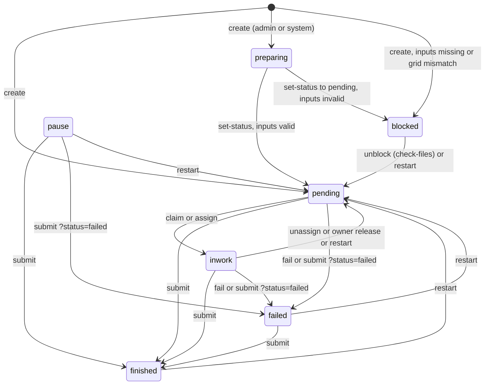

Everything in Clarinet hangs off a four-level hierarchy borrowed from DICOM. A
**Record** is the unit of work: one typed, schema-validated piece of data that
somebody (or some pipeline task) produces about a patient, a study or a series.

```mermaid
erDiagram
    Patient ||--o{ Study : has
    Study ||--o{ Series : has
    Patient ||--o{ Record : "PATIENT level"
    Study ||--o{ Record : "STUDY level"
    Series ||--o{ Record : "SERIES level"
    RecordType ||--o{ Record : types
    Record ||--o{ RecordEvent : audits
```

Records may additionally form a tree among themselves through
`Record.parent_record_id`, independently of the DICOM hierarchy — a
self-referencing FK with **`ON DELETE CASCADE`**, so a DB-level delete removes
descendants rather than orphaning them. Parent existence is validated in
`RecordService.create_record()`.

## Levels

| Level | Required | Expected `None` (convention — unenforced) |
|---|---|---|
| `PATIENT` | `patient_id` | `study_uid`, `series_uid` |
| `STUDY` | `patient_id`, `study_uid` | `series_uid` |
| `SERIES` | `patient_id`, `study_uid`, `series_uid` | — |

**Only the "Required" direction is enforced, and the repository does it** —
`RecordRepository.check_constraints` raises `RecordConstraintViolationError`
when a STUDY or SERIES record arrives without `study_uid`, or a SERIES record
without `series_uid`. Nothing rejects a PATIENT-level record that *also* carries
a `study_uid`.

A `@model_validator` of the same shape exists on `Record`
(`clarinet/models/record.py`), but **it never runs**: SQLModel skips Pydantic
validation for `table=True` models, and both creation paths build the row with
`Record(**payload.model_dump())` rather than `Record.model_validate(...)`. Do
not rely on it when adding a new creation path — bulk import, a backfill, a
fixture — put the check in the repository or perform it yourself.

`Patient.auto_id` is a unique non-PK integer, NOT NULL in the DB but typed
`int | None` in Python. `PatientRepository.create()` assigns it from a
monotonic counter (a PG sequence, or the `AutoIdCounter` row on SQLite);
explicit values advance the counter so they cannot collide. A bare
`session.add(Patient(...))` without `auto_id` raises `IntegrityError` at flush —
test code must supply one or use the factories. `Patient.anon_id` is derived
from it as `f"{settings.anon_id_prefix}_{auto_id}"`.

## RecordType

A `RecordType` is the project's declaration of one kind of work. It names the
JSON Schema for the record's data, the role allowed to do it, the files it
consumes and produces, and optional 3D Slicer scripts. Projects declare record
types in TOML or Python — see [The clarinet_plan package](./plan-package.md).
The behavioural flags (`unique_by`, `shared_editing`, `editable`,
`max_records`, …) and their composition rules have their own page:
[RecordType flags and uniqueness](./record-types.md).

## Status lifecycle

```mermaid
stateDiagram-v2
    [*] --> pending : create
    [*] --> preparing : create (admin or system)
    [*] --> blocked : create, inputs missing or grid mismatch
    preparing --> pending : set-status, inputs valid
    preparing --> blocked : set-status to pending, inputs invalid
    blocked --> pending : unblock (check-files) or restart
    pending --> inwork : claim or assign
    inwork --> pending : unassign or owner release or restart
    pending --> finished : submit
    inwork --> finished : submit
    pause --> finished : submit
    failed --> finished : submit
    pending --> failed : fail or submit ?status=failed
    inwork --> failed : fail or submit ?status=failed
    pause --> failed : submit ?status=failed
    finished --> pending : restart
    failed --> pending : restart
    pause --> pending : restart
```

Admins and system actors may also set any status directly (set-status) except
`preparing → inwork/finished`; system actors use that for locks, re-fires and
retries.

`RecordStatus` has exactly these seven members.

Three statuses mean "not available for work", with distinct exit conditions:

| Status | Why unavailable | Who releases it |
|---|---|---|
| `preparing` | the system is preparing the record (prefill, file/context generation) | flow or pipeline, via an explicit status update |
| `blocked` | prerequisites not met — required input files, or a declared INPUT file whose grid no longer matches its reference | automatically, via check-files |
| `pause` | administrative decision | a human |

Contract details that bite:

- `preparing` exists to remove the race between prefill and a concurrent
  check-files call. `check_files` is a no-op for preparing records: no
  auto-unblock, no checksum scan, no file triggers.
- The explicit `preparing → pending` transition re-validates input files
  **before** writing any status. Invalid files land the record in `blocked`, so
  it is never observable as pending-with-invalid-files.
- Direct `preparing → inwork/finished` is rejected with 409 — a preparing record
  must exit through `pending`. Hard invalidation leaves `preparing` untouched.
- Neither `preparing` nor `blocked` records can be claimed, and
  `find_pending_by_user()` excludes both; an admin may still assign them
  (owner only, status unchanged). Prefill is allowed on both; submit
  returns 409.

`RecordRepository.write_transition` stamps `started_at` when a record enters
`inwork` and `finished_at` when it enters `finished`, in the same UPDATE as
the status. Assigning `status` or `user_id` on a saved record raises
(`DirectRecordWriteError`). The one write outside `write_transition`:
`UserRepository.clear_owned_records` (a Core UPDATE, `user_id = NULL`, status
untouched) runs before `UserService.delete_user` deletes the user, so the
FK's own nullify-on-delete cascade never hits the guard.

## Transitions

Every change of a record's status, owner or submitted data is one of ten
commands, decided by `clarinet/services/record_lifecycle.py::decide` and
written by `RecordRepository.write_transition`:

| Command | Endpoint(s) | Contract | Person | Admin | System |
|---|---|---|---|---|---|
| `create` | `POST /records` | initial status `pending` (`preparing` for admin/system) | ✓ (own type role; owner self or none) | ✓ | ✓ |
| `claim` | `POST /claim-next`, `PATCH /{id}/user` (self) | `pending`/`inwork`, unassigned or own | ✓ | ✓ | ✓ |
| `assign` | `PATCH /{id}/user`, admin `PATCH .../assign` | sets owner; only `pending` moves to `inwork` | — | ✓ | ✓ |
| `unassign` | `DELETE /{id}/user`, admin `DELETE .../user` | clears owner; `inwork` falls back to `pending` | owner only, `releasable` type | ✓ | ✓ |
| `submit` | `POST /{id}/data`, `POST /{id}/submit` | `pending`/`inwork`/`failed`/`pause` → `finished` or `failed` | ✓ | ✓ | ✓ |
| `edit` | `PATCH /{id}/data`, `PATCH /{id}/submit` | `finished` only; status unchanged | ✓ (edit lock) | ✓ | ✓ |
| `fail` | `POST /{id}/fail` | `pending`/`inwork` → `failed` | ✓ | ✓ | ✓ |
| `restart` | `POST /{id}/invalidate` (hard) | any status but `preparing` → `pending` | ✓ (edit lock) | ✓ | ✓ |
| `set_status` | `PATCH /{id}/status`, `PATCH /bulk/status`, admin `PATCH .../status` | raw status change; `preparing` exits only via `pending` | — | ✓ | ✓ |
| `unblock` | `POST /{id}/check-files` | `blocked` → `pending` when inputs are valid | ✓ | ✓ | ✓ |

A person also needs mutation rights (the type's role or superuser, **and**
admin, owner, unassigned, or `shared_editing`) and, for `edit`/`restart`, must
clear the edit lock; system actors get the contracts only — no mutation-rights
or edit-lock check. Downstream flows and workers rely on transitions outside
the nominal lifecycle (restarts from any status, lock/release round trips),
and a refused system write fails silently (workers never retry a 4xx, `.call()`
swallows exceptions) — do not tighten system-actor rules without checking every
downstream project. A new owner (assign, or create with a given or inherited
`user_id`) must hold the type's role or be a superuser, for every actor
including the service token — 409 `OWNER_LACKS_ROLE` otherwise. A person
creating a record may name only themselves or nobody as `user_id` (403); that
covers the payload `user_id` only — an owner inherited via
`inherit_user_from_parent` passes only the role check. A refusal is
403 when the actor may not run the command on this record at all, and 409 when
the command's contract refuses the record's current status; a 409 body carries
`code` (`TRANSITION_NOT_ALLOWED`, `RECORD_EDIT_LOCKED`, `CONCURRENT_TRANSITION`,
`OWNER_LACKS_ROLE`) and `metadata.status` (the record's current status).

`RecordService._transition` owns the pipeline: `record_lifecycle.decide` →
`RecordRepository.write_transition` (one conditional UPDATE on status and
owner, re-decided against fresh state for at most 3 attempts on a concurrent
miss) →
the audit row and matched input-file links join the same transaction → one
commit → SSE and RecordFlow fire only after that commit lands. Status flows
fire `on_status(to)` only when the command actually changes the status; hard
invalidation (`restart`) always fires, even pending → pending. A command that
changes nothing (same status, same owner, no data, no note) writes no audit
event. `RecordRead.allowed_commands` lists the commands the viewer may run on
the record right now (`record_lifecycle.allowed_commands`, filled by
`api/masking.py`) — it does not reflect checks that need I/O (`unique_by`, the
new owner's roles, input files); the endpoint still enforces those.

Why a conditional UPDATE and not a row lock: `SELECT … FOR UPDATE` is a no-op
on SQLite and would hold the lock across the flows' nested API calls; a version
column would pull every `Record` writer (prefill, context-info, viewer lists)
into the locking and needs a migration. The price: status + owner is the whole
write condition, so two concurrent in-place edits of a finished record, or an
A→B→A change between decide and write, go undetected — system edits stay
last-write-wins; #691 removes in-place edits for people.

## Record data vs context_info

`record.data` is the structured, schema-validated payload. Three write paths:

| Method | HTTP | Precondition | Result | Fires |
|---|---|---|---|---|
| submit | `POST /records/{id}/data` | `pending`, `inwork`, `failed` or `pause` | `finished`, or `failed` via `?status=failed` | `on_status()` |
| update | `PATCH /records/{id}/data` | finished | finished | `on_data_update()` |
| prefill | `POST`/`PUT`/`PATCH .../data/prefill` | pending / blocked / preparing | status unchanged | nothing |

`record.context_info` is a separate free-form markdown sidecar for
human-readable context — no schema, no triggers, not part of `data`. It is
served pre-sanitised as `context_info_html` (markdown → HTML → `nh3.clean`).
Anything machine-readable belongs in `data`; anything that should drive
behaviour belongs in `status`.

## Files

File definitions are normalised and shared: `FileDefinition` links to
`RecordType` through `RecordTypeFileLink` (carrying `role` — INPUT / OUTPUT /
INTERMEDIATE — and `required`) and to `Record` through `RecordFileLink`
(carrying `filename` and an optional `checksum`). Write through the ORM
relationship `file_links`; read metadata through the `file_registry` DTO.
`RecordRead.files` and `RecordRead.file_checksums` are deprecated.

Turning a definition into a path on disk is a separate concern with its own
safety contract: [Files and anonymization](./files-and-anonymization.md).

## Audit trail

`RecordService` appends a `RecordEvent` row after every mutation and **before**
dispatching RecordFlow, with kinds `created`, `status_changed`,
`data_submitted`, `data_updated`, `assigned`, `unassigned`, `failed`,
`invalidated`, `context_info_updated`, `files_cleared`, `deleted`. The actor is
the person's UUID, or `None` for a system actor (`X-Internal-Token`: pipeline
workers, RecordFlow, cron, operator scripts). A status, owner or data change
and its event commit in one transaction. `from_status` / `to_status` are set
only when the command changed the status; a submit or edit that changes the
owner records it in its one event (`new_value.user_id`, `via`) instead of a
separate `assigned` event. `record_event.record_key` is a denormalised record
id with no FK, so a deleted record's history stays correlatable. Prefill
writes are deliberately not audited.

## Access control

`AuthorizedRecordDep` grants read access to superusers and to holders of the
record type's role; `MutableRecordDep` adds mutation for admins (`is_admin`),
the assigned user or an unassigned record (and bypasses the owner check when
`shared_editing` is set). Every single-record mutation goes through it —
including `/fail`, `/invalidate`, `/check-files` (it can unblock a record and
fire file-change flows) — except the owner changes: `PATCH` and `DELETE
/records/{id}/user` take only `AuthorizedRecordDep`, because claim, assign
and release rights are the lifecycle policy's call. `PATCH /bulk/status` carries no per-target router
dependency of its own; the service-level policy alone makes it admin- and
service-token-only.
The record service re-checks the same rights itself (lifecycle policy), so no
endpoint can change status or ownership past a weaker router dependency. Raw
status changes and assigning another user are admin-only; unassigning is too,
except that the owner of a pending/inwork record may give it back when its
type sets `releasable`. Assign sets the owner and only moves `pending` to
`inwork`; a non-admin claims for themselves an unassigned (or own)
`pending`/`inwork` record. The edit lock yields to admins — superuser or
`admin` role.
*Creating* a record is a third rule (`check_record_type_role` on
`POST /api/records`): an admin — superuser **or** `admin` role — or a holder of
the type's role; a `role_name = NULL` type is admin-only. The create predicate
is a deliberate choice (it agrees with the other admin guard on that endpoint);
its mismatch with the read rule is unresolved: reads do not recognise the
`admin` role, so an `admin`-role non-superuser who lacks the type's role can
create a record it cannot read back. The Slicer record endpoints
(`/api/slicer/records/{id}/open|validate`) ship the record's context to the
caller's machine and use `AuthorizedRecordDep`.
Beyond roles, capabilities map roles to features in `settings.toml`
(`[role_capabilities]`); superusers and the built-in `admin` role hold every
capability implicitly. Non-superusers see patient identifiers masked by `mask_records`
(`clarinet/api/masking.py`) — but this is **not** an unconditional guarantee.
Masking is skipped when the patient has no `anon_name`, and when the record
type sets `mask_patient_data=False`, the deliberate opt-out for roles that need
real identifiers (every such access is audit-logged). `viewer_study_uids` /
`viewer_series_uids` are written by pipelines, so they may hold raw UIDs: a raw
entry is replaced by the anon UID of the matching study/series **of the
record's own patient**, a known anon UID is kept as-is, the record's own
study/series show what its top-level `study_uid` / `series_uid` show (raw until
the study is anonymized — the frontend opens the first entry), and anything
else is dropped. Writing the lists (`PATCH /api/records/{id}`) is admin-only:
for any other writer, whether an entry comes back kept or dropped would reveal
whether a study belongs to the record's patient.

An authenticated account with **no role** is meant to be entitled to nothing.
Accounts are created by an admin (`/api/user`); public self-registration
(`POST /api/auth/register`) answers 403 unless `registration_enabled` is set,
and an account made that way starts role-less. Record list/find endpoints
filter by role and single-record endpoints use `AuthorizedRecordDep`, but the
DICOMweb proxy (`/dicom-web/*`) has no per-record check — it reads straight
from the PACS — so its router uses `current_dicomweb_user`, the same gate as
`current_role_holder` (admin, or at least one role), whose passed
session-cookie verdict is reused for `session_cache_ttl_seconds`. With
`dicomweb_backend = "external"` images bypass that router entirely; nginx must
authorize them through `GET /api/auth/dicomweb-access`, which carries the same
gate (see `docs/orthanc-dicomweb-proxy.md`).

This is a per-router property, not a global guarantee: any router without its
own per-object authorization needs the same gate, because "authenticated" alone
is not an access level.
