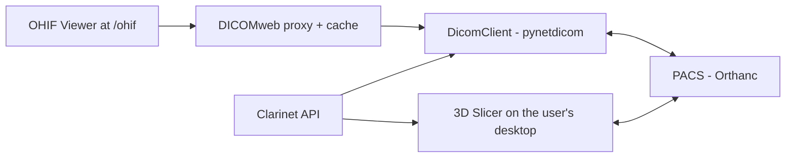

Three integrations, each pointing at a different consumer of the same images.

## DICOM client

`clarinet/services/dicom/` — `DicomClient` is the async facade; `DicomOperations`
is the synchronous pynetdicom layer and must never be called directly from async
code. Everything crosses over via `asyncio.to_thread()`.

- `StorageHandler` serves incoming C-STORE in three modes: `DISK`, `MEMORY`,
  `FORWARD`. `stored_instances` is a `dict[str, Dataset]` keyed by SOPInstanceUID.
- `DicomOperations._association()` holds a global **`threading.Semaphore`**
  (not asyncio — the function is synchronous) limiting concurrent associations
  across DICOMweb, anonymization and import; sized from
  `dicom_max_concurrent_associations` in the app lifespan.
- `store_instances_batch` sends many datasets over **one** association, versus
  `store_instance` which opens one per dataset. Anonymization uses it per series,
  fanning out to every destination node sequentially; one node's failure never
  aborts the rest.
- `SeriesFilter` drops non-image series (SR, KO, PR, tiny series) at import
  and/or anonymization time. Pure logic over a `SeriesFilterCriteria` DTO, so it
  works from both C-FIND results and DB models.

Connection settings live under `pacs_*` and `dicom_*` (env: `CLARINET_PACS_HOST`
and friends). The test PACS is Orthanc on `localhost:4242`, AET `ORTHANC`, with
its REST API on `:8042`.

Anonymization, and the path contract that governs where anonymized files land,
are covered in [Files and the anonymized-path contract](/files-and-anonymization.md).

## DICOMweb proxy

`clarinet/services/dicomweb/` translates QIDO-RS and WADO-RS into C-FIND/C-GET
so OHIF can display images from a PACS that speaks only DICOM Q/R. OHIF is
served at `/ohif` and the proxy at `/dicom-web` — same origin, so session
cookies just work. This built-in proxy is one of two options: `dicomweb_backend`
defaults to `builtin`, but can be set to `external` to point OHIF at a real
DICOMweb server instead, which then requires `dicomweb_external_root`.

Four tiers, checked in order:

1. **Memory** — `TTLCache` of `MemoryCachedSeries`, O(1) by SOPInstanceUID, LRU
   eviction (`dicomweb_memory_cache_ttl_minutes`, `..._max_entries`).
2. **`dcm_anon/`** — anonymized files written by `AnonymizationService` into the
   working folder. The files never expire; the *resolved-path* cache does, and
   its TTL bounds how long a negative cache entry can hide an
   anonymize-after-first-read race. Force it with
   `DicomWebCache.invalidate_dcm_anon_path(study_uid, series_uid)`.
3. **Disk** — `{storage_path}/dicomweb_cache/{study}/{series}/*.dcm` plus a
   `.cached_at` marker. DICOM on the PACS is immutable, so staleness is a
   non-concept and the read path returns whatever is present. Lifecycle is owned
   solely by `DicomWebCacheCleanupService` (TTL and size eviction, both off the
   event loop) — keep `dicomweb_cache_cleanup_enabled=True` or disk growth is
   unbounded.
4. **C-GET into memory**, returned immediately, with a background
   `asyncio.create_task` persisting to disk under a semaphore
   (`dicomweb_disk_write_concurrency`, default 4).

An `asyncio.Lock` per `(study_uid, series_uid)` prevents duplicate C-GETs, and a
study-level lock does the same for `ensure_study_cached()`, which retrieves all
missing series in a **single** study-level C-GET instead of N per-series ones.

Two ways to warm the cache without going through the viewer:
`POST /dicom-web/preload` (1–20 study UIDs, cached sequentially so the PACS is
not flooded, progress polled by `task_id`), and the `prefetch_dicom_web`
pipeline task, which runs in a worker, writes straight to the disk tier and
bypasses the memory tier entirely — the safe choice for bulk RecordFlow triggers.

## 3D Slicer

`clarinet/services/slicer/` posts Python scripts to the Slicer instance running
on the **user's own desktop** (`http://{client_ip}:{settings.slicer_port}`), so
the client is short-lived and per-request, with no pooling.
`SlicerService.execute()` composes the script from the cached `helper.py` DSL,
the hydrated context, and the user code.

`helper.py` runs *inside* Slicer, not in Clarinet — it is read as text and
shipped as payload, and carries `_Dummy` stubs so it stays importable without
Slicer. `PacsHelper` inside it does C-FIND plus C-GET/C-MOVE through
`ctkDICOMQuery`/`ctkDICOMRetrieve`, and both `retrieve_study` and
`retrieve_series` are **local-first**: they check `slicer.dicomDatabase` before
touching the network, which makes reopening a study near-instant.

PACS parameters are hybrid. `build_slicer_context()` injects `pacs_host`,
`pacs_port` and `pacs_aet` unconditionally, and that branch always wins for
API-driven calls; only the per-user `calling_aet`/`move_aet` come from Slicer's
QSettings. **A deployment that configured PACS only in Slicer must still set
`CLARINET_PACS_HOST`/`PORT`/`AET`**, or record-open loads target the defaults.

The storage prefix visible to the user's Slicer is per-client: the
`X-Clarinet-Storage-Path-Client` header (with a cookie fallback that survives
form submits stripping custom headers), then `settings.storage_path_client`,
then no translation at all. `get_client_storage_path` enforces ≤512 bytes and
printable ASCII (0x20–0x7E), rejecting silently rather than raising so a bad
header cannot break the unrelated endpoints that share the dependency. The path
*content* is deliberately not parsed — UNC, a mounted POSIX path, a drive
letter and `smb://…` are all legitimate, and Slicer on the client machine is
the authority on what works locally.

### `__execResult` — how a validator writes into a record

A `slicer_result_validator` script can assign `__execResult = {...}` and those
keys are merged into `record.data` on save. The flow is: submit → validate
against the schema (pass 1) → run the validator in Slicer → merge
`__execResult` over the validated data, **validator wins** on collisions →
re-validate the merged dict (pass 2) → persist.

The canonical use is a field marked `"x-widget": "hidden"` in the JSON Schema:
the form does not render it, the validator computes it. **Do not mark such
fields `required`** — pass 1 runs against the still-empty form and would 422
before Slicer ever runs. For a presence guarantee, use a custom Python validator
with `run_on_partial=False`, which runs during pass 2.

This merge exists because HTTP callbacks from a validator are impossible: at
that moment the record is `inwork` and mid-transition, so prefill rejects it,
`PATCH /data` rejects it, and `POST /data` would recurse.

## Image processing

`clarinet/services/image/` is a synchronous, CPU-bound library (NIfTI/NRRD read
and write, DICOM series read-only, segmentation morphology and set operations,
a component-correspondence engine). Call it from pipeline tasks inside
`asyncio.to_thread()`. Full behavioural reference:
[`docs/image-service.md`](../image-service.md).
