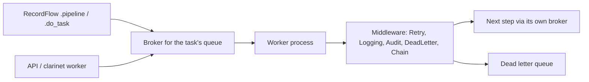

Long-running work — GPU segmentation, DICOM retrieval, report rendering —
runs on remote workers rather than in the request. The transport is TaskIQ over
RabbitMQ, chosen over FastStream for its built-in retry, DLQ and FastAPI DI
compatibility. Enabled by `pipeline_enabled`.



## Queues and brokers

`kind` is one of `default`, `gpu`, `dicom`, `quarto`, `dead_letter`, and the
namespace is normalised from `project_name` — a project named "Acme" gets
`acme.*`.

**The queue name is versioned by default.** With `pipeline_version_check_enabled`
(on unless you turn it off), `Settings._versioned_queue` composes
`{namespace}.{fingerprint}.{kind}` — e.g. `clarinet.a1b2c3d4e5f6.gpu` — where
the hex segment covers the clarinet version plus `plan/` content, so a worker
running stale code listens on a different, dead queue. Disable the gate and the
name collapses to `{namespace}.{kind}`. The dead-letter queue is the exception:
`dlq_queue_name` is always `{namespace}.dead_letter`, unversioned. Grepping a
broker for a literal `clarinet.default` therefore finds nothing on a default
install.

**routing_key is the full queue name**, which is what prevents cross-project
collisions on a shared exchange (`settings.rabbitmq_exchange`, direct type).

Each queue has its own `AioPikaBroker` via `get_broker_for(queue_name)`, and
tasks bind to their broker at decoration time — so `task.kicker().kiq()` always
publishes to the right queue with no routing-key juggling. Always read
`settings.gpu_queue_name` and friends, which compose whichever form is current
— never hard-code a queue string.

## Defining a task

`@pipeline_task()` handles `PipelineMessage` parsing, `ClarinetClient`
lifecycle, `TaskContext` construction and registration in `_TASK_REGISTRY`.
Retries are on by default.

```python
from clarinet.services.pipeline import pipeline_task, PipelineMessage, SyncTaskContext

@pipeline_task(queue=settings.gpu_queue_name)
def run_segmentation(msg: PipelineMessage, ctx: SyncTaskContext) -> None:
    model.predict(ctx.files.resolve("ct_image"), ctx.files.resolve("segmentation"))

@pipeline_task(auto_submit=True)
def compare(msg: PipelineMessage, ctx: SyncTaskContext) -> dict:
    return {"false_negative": 12}      # dict result is submitted to the record
```

- **Sync handlers are auto-detected** (`inspect.iscoroutinefunction`), run in a
  thread via `asyncio.to_thread()`, and receive `SyncTaskContext` with
  `SyncRecordQuery` / `SyncPipelineClient` wrappers.
- **`auto_submit=True`** submits a returned `dict` via
  `client.submit_record_data(msg.record_id, result)`, before file-change
  detection. Skipped for non-dict results or a missing `record_id`.
- **File-change detection is automatic**: after a successful run the wrapper
  checksums every file touched through `ctx.files` and reports changes to
  `POST /patients/{id}/file-events`, which fires RecordFlow file triggers.
- `@broker.task` still works for simple tasks that need no context, but such a
  task must be passed to `register_task()` explicitly so chain advancement can
  find it by name.

`TaskContext` carries `files` (a `Files` instance for the task's own record),
`records` (a query helper), `client` and `msg`. To resolve files of a *different*
record you already hold, use `ctx.files_for(record)`; for lookup by criteria use
`ctx.records.file_path(...)`. Path resolution has its own safety contract:
[Files and anonymization](/files-and-anonymization.md).

## Chains

```python
imaging = Pipeline("ct_segmentation").step(fetch_dicom).step(run_segmentation).step(report)
```

Step queues come from the tasks themselves. Passing an explicit
`Pipeline.step(task, queue=...)` that disagrees with the task's own binding
raises `PipelineConfigError` — silently re-routing would publish to a broker the
task is not listening on.

Chain state lives in the DB, not in the message. `Pipeline.run()` dispatches
only the first step; task labels carry `pipeline_id` + `step_index`. After each
step `PipelineChainMiddleware.post_execute()` fetches the definition over HTTP
(`GET /api/pipelines/{name}/definition`) and dispatches the next step through
that step's own broker. The chain stops on error. Definitions are upserted at
startup by `sync_pipeline_definitions()` and on demand via
`POST /api/pipelines/sync`.

## Retry, DLQ and ordering

- 3 retries by default, exponential backoff with jitter, 120 s max delay.
- **Business errors are never retried.** `RetryMiddleware` inspects
  `ClarinetAPIError.status_code`; 400–499 goes straight to the DLQ, because a
  409/404/422 will fail identically on every attempt. 5xx and non-HTTP errors
  (`ConnectionError`, `TimeoutError`) retry normally.
- `DLQPublisher` holds one shared AMQP connection to `settings.dlq_queue_name`,
  created in `create_broker()` and shared by `DeadLetterMiddleware` (which owns
  its lifecycle) and `PipelineChainMiddleware`.
- Middleware order is **Retry → Logging → Audit → DeadLetter → Chain**;
  DeadLetter must precede Chain so the publisher is started before Chain needs it.
- `pipeline_ack_type` defaults to `when_executed`, so a worker crash redelivers.

## Run audit

`AuditMiddleware` writes every execution to `pipeline_task_run` (PK = the TaskIQ
`task_id`): `pre_execute` POSTs a `running` row, `post_execute` PATCHes the
terminal status. Writes go through `ClarinetClient` with the service token,
fire-and-forget, but the PATCH awaits its own POST so it never races the insert,
and a late `retrying` never downgrades a terminal status. Absent entity ids are
stored as NULL, never `''` — except `queue`, which workers legitimately send
empty. Read via `GET /api/pipelines/runs` (admin) or `GET /api/records/{id}/runs`.

## Workers

```bash
clarinet worker                        # auto-detect queues
clarinet worker --queues default gpu   # explicit
clarinet worker --dicom WORKER:4006    # with a Storage SCP for C-MOVE
```

With `pipeline_version_check_enabled` (default on), a version fingerprint
(clarinet version + a hash of `plan/`) is embedded in queue names, so a stale
worker listens on a dead queue instead of running outdated code; the worker also
compares its fingerprint against `GET /api/pipelines/fingerprint` at startup.

Built-in tasks live in `clarinet/services/pipeline/tasks/` and
`clarinet/services/dicom/pipeline.py`, and are imported when the broker starts:
`convert_series_to_nifti`, `prefetch_dicom_web` and `anonymize_study_pipeline`
each skip work already done, so a retry is cheap; `render_quarto_report` and
`call_registered_callable` carry no such guarantee — assume they re-execute.
`register_task()` refuses to let a project task shadow a built-in of the same
name.

Settings tables, testing with `InMemoryBroker` and RabbitMQ cleanup:
`.claude/rules/pipeline-ops.md`.
