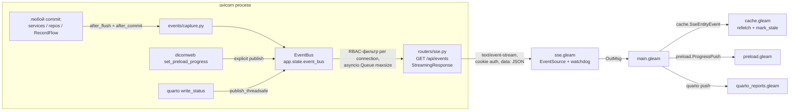

# План перехода на SSE (Server-Sent Events)

> Конверсия [websocket-migration-plan.md](https://github.com/radionest/clarinet/blob/claude/websocket-migration-plan-wdfq3k/docs/websocket-migration-plan.md) на SSE. Backend-движок событий (capture + bus + RBAC + audit) транспортно-независим и переносится целиком; меняется только «труба» на концах (эндпоинт, фронт-транспорт, nginx) и пропадает часть кода, которая в WS была нужна только из-за двунаправленности и рукопожатия-upgrade.

## Контекст

Сейчас фронтенд узнаёт об изменениях данных только через явные перезагрузки и поллинг:
- кэш сущностей (`cache.gleam`) обновляется только по `ReloadX`/`CacheX` после действий самого пользователя; изменения, сделанные RecordFlow, pipeline-задачами или другими пользователями, не видны до ручного обновления (TTL бакетов 60 с работает только при повторном заходе на страницу);
- прогресс preload OHIF поллится таймером (`preload.gleam` → `GET /dicom-web/preload/progress/{task_id}`);
- статус Quarto-рендера поллится каждые 3 с до 200 раз (`pages/admin/quarto_reports.gleam`).

Цель: единый SSE-поток `GET /api/events`, по которому сервер пушит события об изменениях сущностей и прогрессе задач. Кэш фронта становится событийным, поллинг уходит (остаётся только как fallback при разрыве потока).

## Почему SSE, а не WebSocket

Протокол этой задачи **уже односторонний** (server→client; «v1 клиент ничего не шлёт», а клиентский `send()` в WS-плане выпилен как YAGNI). Это ровно то, что SSE даёт нативно, без накладных расходов двунаправленного канала. Конкретные выигрыши SSE в нашем контуре:

| Аспект | WebSocket | SSE |
|---|---|---|
| Эндпоинт | отдельный ASGI-протокол `websocket()` | обычный HTTP `GET` + `StreamingResponse(media_type="text/event-stream")` |
| Auth | кастомный `authenticate_websocket()` (ручное чтение cookie до `accept()`) | штатный `CurrentUserDep` (cookie-сессия) прямо на роуте; невалидная cookie → FastAPI отдаёт **401**, `EventSource` останавливается навсегда (нет reconnect-шторма) |
| Зависимости | нужен пакет `websockets` | **ничего** — `StreamingResponse` это ядро Starlette |
| Reconnect | пишем вручную (backoff, watchdog, reconnect-таймеры) | **нативный** в `EventSource`; интервал задаёт сервер строкой `retry:` |
| Catch-up после разрыва | вручную | нативный `Last-Event-ID` (на будущее; в v1 не используем) |
| Детект disconnect | receive-loop-дренаж | отмена async-генератора (`finally`) |
| За nginx | `Upgrade`/`Connection: upgrade` | `proxy_buffering off` / заголовок `X-Accel-Buffering: no` |

**Единственная плата SSE** — лимит ~6 одновременных соединений на хост в HTTP/1.1 (WS этот пул не занимает). Лимит делится на **весь** origin (XHR/fetch/картинки), а живой SSE держит слот навсегда → даже 2–3 вкладки с открытым стримом могут голодать обычные REST-запросы. Снимается переходом nginx на **HTTP/2** (см. «nginx» ниже): мы уже на TLS, это одна строка конфига, и лимит исчезает как класс.

## Ключевые решения

### Авторизация: штатный `CurrentUserDep`, `authenticate_websocket` НЕ нужен

SSE-поток — это обычный HTTP GET. `EventSource` на тот же origin автоматически шлёт cookie `clarinet_session` (HttpOnly, SameSite=Lax) — её валидирует существующая зависимость `current_active_user` (`auth_config.py`, «service token → cookie fallback»), как и на любом другом роуте (`read_token` при этом дёргает fastapi_users как strategy of auth_backend, не зависимость напрямую — на вывод «плохая cookie → 401» это не влияет). Поэтому:

- **на фронте — ноль auth-кода**: токен нигде не хранится и не передаётся;
- **на бэке — минус целый helper**: `authenticate_websocket()` из WS-плана не пишется; вместо него — `user: CurrentUserDep` в сигнатуре роута;
- **отказ при невалидной cookie бесплатен**: FastAPI отдаёт 401 до старта стрима → по спецификации WHATWG `EventSource` переходит в `CLOSED` и **не реконнектится** (в отличие от WS, где close до `accept()` виден браузеру как 1006 и уводит в бесконечный reconnect — отступление #1 WS-плана здесь не нужно).

Жизненный цикл долгоживущего соединения:
- при connect: `CurrentUserDep` валидирует cookie до старта генератора; провал → 401, поток не открывается;
- ревалидация каждые `sse_revalidate_seconds` (default 300): внутри генератора повторный `DatabaseStrategy.read_token` по токену из `request.cookies` (короткоживущая сессия БД, с `request` → тем же IP-binding, что у обычных роутов; учитывай TTL-кэш валидаций `session_cache_ttl_seconds` — отзыв детектится с задержкой ≤ TTL); если сессия истекла/отозвана — сервер шлёт кадр `{"type":"auth_expired"}` и закрывает поток; клиент делает `EventSource.close()` (стоп без reconnect) + `Logout`;
- backstop: если клиент пропустил кадр и `EventSource` авто-реконнектится — реконнект приходит с уже невалидной cookie → 401 → `CLOSED`, тихий стоп;
- app-level ping `{"type":"ping"}` раз в 30 с удерживает поток непустым внутри nginx `proxy_read_timeout 300s` (идл не наступает).

### Клиентский транспорт: свой FFI-модуль `utils/event_source.gleam` (без новых Gleam-зависимостей)

Нативной поддержки `EventSource` в Lustre 5.x нет — пишем тонкий FFI по образцу `modem` (официальный lustre-labs паттерн `effect.from` + external-колбэки) и конвенций проекта (`utils/viewer_window.gleam` + `.ffi.mjs`):
- opaque `pub type EventSource`; события `Opened(EventSource) | MessageReceived(String) | Errored(ready_state: Int)`;
- `connect(path, to_msg) -> Effect(msg)` — один эффект; колбэки живут всю жизнь источника и диспатчат многократно; первой строкой guard `use <- bool.guard(!lustre.is_browser(), Nil)` (защита gleeunit от `new EventSource` вне браузера);
- **`send`/`close-by-code` не реализуем** — у SSE нет клиент→сервер канала вообще (в WS-плане это было осознанным отступлением #5; здесь — свойство среды);
- резолв относительного пути и `withCredentials: true` — в FFI; sub-path деплой работает через `config.base_path() <> "/api/events"`;
- `Errored(ready_state)` отдаёт `EventSource.readyState` наружу: `0` (CONNECTING) = браузер сам реконнектится (транзиент, ничего не делаем); `2` (CLOSED) = постоянный отказ (обычно 401/503) — стоп без reconnect.

**Reconnect — нативный (`EventSource`), не ручной.** Браузер сам переподключается после разрыва; интервал детерминируется сервером (`retry: 3000` первой строкой потока — без экспоненты, что для одного uvicorn-процесса и небольшого числа клиентов приемлемо). Поэтому `sse.gleam` **теряет** ручной backoff, счётчик `attempt`, `ReconnectTick`-таймер; **оставляет** только: `state`, флаг `has_connected_once` (даёт `reconnected: Bool` для resync) и watchdog (анти-зомби: если ни одного кадра, включая ping, за 90 с — принудительный `close()` + новый источник, т.к. на «тихий» полуоткрытый сокет `EventSource` сам ошибку не выдаст).

Бэкенд: SSE-роут — это штатный Starlette `StreamingResponse`; **новых зависимостей не требуется** (в отличие от WS, где нужен пакет `websockets`).

### Источник событий: SQLAlchemy after_flush/after_commit, а не ручные publish

> Транспортно-независимо — переносится из WS-плана дословно.

Мутации разбросаны (RecordService, StudyService, AdminService, прямые `repo.update_fields` в роутерах — например context_info в `record.py:398`), и ручные publish-вызовы легко забыть. Вместо этого — слушатели на `sqlalchemy.orm.Session` (sync-сессия внутри AsyncSession):
- `after_flush`: для наблюдаемых моделей (`Record`, `Patient`, `Study`, `Series`, `RecordType`, `User`) из `session.new/dirty/deleted` собрать «тонкие» события `{entity, action, id}` (+ для Record — колонки `record_type_name`, `user_id`, доступные без lazy-load) в `session.info["clarinet_sse_events"]`;
- `after_commit`: передать накопленное в bus; `after_rollback`: очистить.

Это перехватывает в одной точке **все ORM-мутации** (`session.add/delete`, изменение атрибутов загруженных объектов) — независимо от того, выполнил их сервис, прямой `repo.*` или роутер. RecordFlow и pipeline-воркеры мутируют через HTTP API (`ClarinetClient`) → коммиты происходят в том же uvicorn-процессе (он один: `uvicorn.run` в `cli/main.py` без workers) → события не теряются. В процессах TaskIQ-воркеров слушатель срабатывает вхолостую (bus без подключений) — no-op. Три класса мутаций UoW **не** видит — для них точечный явный publish (см. «Границы перехвата»).

События «тонкие» намеренно: ни одного поля данных по потоку не передаётся — клиент дотягивает изменённое существующими REST-эндпоинтами под своим RBAC. Это исключает утечку маскируемых данных (`mask_records`) и убирает сериализацию/авторизацию полных объектов.

#### Границы перехвата: что UoW-слушатель НЕ видит

`after_flush` отслеживает только ORM Unit of Work (`session.new/dirty/deleted`). Мутации в обход ORM его минуют — для них **точечный явный publish в data-access слое** (в репозиториях, не в сервисах: «один источник на слой данных» сохраняется). ORM-каскадов «мимо сессии» нет — FK заданы `ondelete=` на уровне БД, но relationship'ы помечены `cascade_delete=True` (ORM грузит детей при flush → они попадают в `session.deleted`; проверяется тестом, см. tasks-doc 2.9).

| Класс мутации | Пример в коде | Почему невидимо | Обход |
|---|---|---|---|
| **DB-cascade `ON DELETE CASCADE`** | `Patient→Study→Series→Record→RecordFileLink` | `session.delete(patient)` эмитит только `DELETE patient`, если ORM-каскад не догрузил детей | explicit `emit_entity(...)` `deleted` для затронутых Study/Series/Record (только если тест покажет, что UoW их не видит) |
| **DB-cascade `ON DELETE SET NULL`** | `Record.parent_record_id` | у дочерних `parent_record_id` обнуляется СУБД молча | при необходимости — explicit `record/updated` (минорно: parent редко влияет на UI) |
| **Core-bulk DML** | `RecordRepository.delete_records` → `sa_delete(Record).where(id.in_(...))` | Core-`DELETE`, объекты не проходят через `session.deleted` | explicit `emit_entity(...)` `record/deleted` прямо в `delete_records` |
| **Raw SQL** | `report_repository.py` | минует ORM целиком | не требуется: отчёты `READ ONLY` |

Помечать такие call-sites маркером `# sse-capture: explicit emit, UoW-invisible`.

#### Корректность слушателя

> Идентично WS-плану — слушатель один и тот же, транспорт ни при чём.

- **Savepoint.** `PatientRepository.create` оборачивает вставку в `session.begin_nested()` (retry auto_id). Публиковать **только на внешнем commit**; `after_rollback` чистит лишь события своего scope. Обязателен тест на savepoint-путь.
- **publish не роняет commit.** Тело `after_commit` — в `try/except` с логированием: COMMIT уже состоялся.
- **Идемпотентность за запрос.** `session.info`-буфер очищается после emit.
- **Только column-атрибуты** в `after_flush` — обращение к relationship даёт `MissingGreenlet`.
- **Детектор рассинхрона аудита.** uow-событие `record`, не покрытое audit-событием в той же транзакции и затронувшее аудируемую колонку (`status`, `user_id`, `data`, `context_info`, факт создания/удаления), означает мутацию мимо `_record_event`. Прод: `logger.warning`. Тесты: strict-режим `CLARINET_SSE_AUDIT_STRICT=1` копит «осиротевшие» события для `assert orphans == []`.

#### Совместимость с audit-журналами (PR #332 `record_event`, #330 `pipeline_task_run`)

> Идентично WS-плану. Источник трёхслойный — audit поверх UoW.

1. **UoW-слой (страховка).** `after_flush` даёт тонкое событие при любой ORM-мутации, даже если эмиттер аудита забыт.
2. **Audit-обогащение (приоритет).** Вставки `record_event` → `record`-событие с `actor_id` и точным `kind`; `pipeline_task_run` → `task_progress`. Маппинг `kind → action`: `created→created`, `deleted→deleted`, прочее → `updated`.
3. **Детектор рассинхрона** ловит мутации мимо аудита.

**Дедуп (per-transaction).** На `after_commit` дедуп по `(entity, id)`: есть audit → uow-дубль выбрасывается (audit богаче); запись мимо аудита оставляет тонкое uow-событие (+ warning детектора). **Покрытие:** трёхслойность только для `record`; `pipeline_task_run` наблюдается напрямую; `preload`/`quarto` не-ORM → только explicit publish; `patient/study/series/record_type/user` журнала не имеют → чистый UoW.

**Порядок мержа.** Мержить #330/#332 → main первыми, SSE-ветка ребейзится поверх (Фаза 5 заблокирована до этого).

### RBAC-фильтрация на сервере (per-connection)

> Идентично WS-плану — фильтрация в bus, транспорт ни при чём.

- superuser / роль `admin` — получают всё;
- события `patient/study/series/user` — только админам;
- события `record` — обычному пользователю, если `record_type_name` входит в его доступные типы (тот же RBAC-запрос, вычисляется при connect, обновляется при ревалидации и при событии `record_type`) **или** `event.user_id == connection.user_id`;
- `record_type` — всем аутентифицированным.

## Протокол (SSE-кадры, server→client; v1 клиент ничего не шлёт)

Каждый кадр — это SSE-`data:` строка с тем же JSON, что в WS-плане (полезная нагрузка **байт-в-байт** та же, меняется только обёртка):

```
retry: 3000

data: {"type": "entity", "entity": "record", "action": "created|updated|deleted", "id": "123", "record_type_name": "ct_seg", "user_id": "<uuid>|null"}

data: {"type": "entity", "entity": "patient|study|series|record_type|user", "action": "...", "id": "<string id/uid/name>"}

data: {"type": "task_progress", "task": "preload", "task_id": "...", "payload": {...как текущий ответ поллинга...}}

data: {"type": "task_progress", "task": "quarto_render", "task_id": "<render_id>", "payload": {...}}

data: {"type": "auth_expired"}

data: {"type": "ping"}
```

- `retry: 3000` — одна строка в начале потока: задаёт интервал нативного reconnect `EventSource` (3 с), детерминированно во всех браузерах.
- Все кадры — безымянные `data:`-события → у клиента всегда срабатывает `onmessage`. SSE-комментарии (`: ...`) и `retry:` обрабатываются `EventSource` внутренне и до JS не доходят — поэтому keepalive делаем **`data:`-кадром `ping`** (его видит и watchdog, и декодер уже знает тип `Ping`), а не комментарием.
- `id` — всегда строка; декодер фронта (`sse_events.gleam`) и ключи кэша уже строковые.
- **Нет close-кодов** (у SSE их не существует). Их семантика выражена на уровне приложения: auth → кадр `auth_expired` + закрытие потока (клиент `close()`, без reconnect); slow consumer → просто закрыть поток (`EventSource` сам реконнектится → resync); прочие разрывы → авто-reconnect.

## Схема потока



## Изменения: бэкенд

**Новый модуль `clarinet/services/events/`** (идентичен WS-плану — bus/capture транспортно-независимы):
- `models.py` — Pydantic-модели событий (`EntityEvent`, `TaskProgressEvent`) + `to_wire()` (тот же JSON).
- `bus.py` — `EventBus`: `register/unregister`, `publish` (итерация по подключениям, RBAC-предикат, `put_nowait`; переполнение → закрыть как slow consumer), `publish_threadsafe` (для `write_status` из `asyncio.to_thread`), `shutdown`. Per-connection dataclass `SseConnection` (был `WsConnection` — только переименование). Хранит loop, создаётся в lifespan → `app.state.event_bus`.
- `capture.py` — слушатели `after_begin`/`after_flush`/`after_commit`/`after_rollback`, карта наблюдаемых моделей, экспорт `emit_entity(...)`. Только column-атрибуты. Dual-source поверх ORM-страховки + дедуп + детектор рассинхрона.

**Новый роутер `clarinet/api/routers/sse.py`** — `@router.get("/events")`, монтируется под `/api` (рядом с `health`), условно по `settings.sse_enabled`:
- **auth штатной зависимостью** `user: CurrentUserDep` (cookie-сессия) — `authenticate_websocket` не нужен;
- возвращает `StreamingResponse(gen(), media_type="text/event-stream")` с заголовками `Cache-Control: no-cache`, `X-Accel-Buffering: no` (отключает буферизацию nginx для этого ответа), `Connection: keep-alive`;
- генератор: регистрирует `SseConnection` в bus → `yield "retry: 3000\n\n"` → цикл: ждёт свою `asyncio.Queue` до ближайшего дедлайна; раз в 30 с — `data: {"type":"ping"}`; раз в `sse_revalidate_seconds` — ревалидация токена из `request.cookies` (свежая сессия), при провале `auth_expired` + закрытие; sentinel `None` из bus (slow consumer) → закрытие; после отправки кадра с `"record_type"` — пересчёт `conn.allowed_types`; `finally: bus.unregister(conn)`;
- **receive-loop отсутствует** (SSE односторонний); disconnect ловится отменой генератора при разрыве клиента.

**`clarinet/api/auth_config.py`** — изменений нет (используем существующий `current_active_user`; для ревалидации внутри генератора — существующий `DatabaseStrategy.read_token`).

**Публикация прогресса задач (фаза 4)** — идентично WS-плану:
- `dicomweb/service.py::_preload_worker` — `publish_threadsafe(TaskProgressEvent(task="preload", ...))` адресно инициатору;
- `quarto_render.py::write_status` — `publish_threadsafe(task="quarto_render", ...)` админам.

**`clarinet/settings.py`** — `sse_enabled: bool = True`, `sse_revalidate_seconds: int = 300`, `sse_send_queue_size: int = 256`. **`clarinet/api/routers/info.py`** — добавить `sse_enabled` в ответ `/api/info`.

**`pyproject.toml`** — **без изменений** (`StreamingResponse` — ядро Starlette; пакет `websockets` не нужен). Опционально можно взять `sse-starlette` ради `EventSourceResponse` (встроенный ping + `is_disconnected()`), но ручной `StreamingResponse` тривиален и не тянет зависимость — берём его.

Миграций БД нет (схема не меняется).

## Изменения: фронтенд

**Новый `src/utils/event_source.gleam` + `src/utils/event_source.ffi.mjs`** — низкоуровневый транспорт (устройство — см. «Клиентский транспорт»). FFI: `connect(path, onOpen, onMessage, onError)` создаёт `new EventSource(url, {withCredentials: true})`, вешает `onopen/onmessage/onerror`; `closeSource(es)` снимает `onerror` (чтобы намеренное закрытие не выглядело как ошибка) и зовёт `es.close()`.

**Новый `src/sse.gleam`** — самодостаточный MVU-модуль по образцу `preload.gleam` (поверх `utils/event_source`), **проще ws.gleam за счёт нативного reconnect**:
- `State`: `Idle | Connecting | Active(event_source.EventSource)`; `Model` хранит `state`, `has_connected_once: Bool`, `watchdog: Option(global.TimerID)` — **без** `attempt`/`reconnect_timer`;
- `Connect` → `event_source.connect(config.base_path() <> "/api/events", Event)`;
- `Opened(es)` → `Active`; OutMsg `SseConnected(reconnected: has_connected_once)` (main запускает resync только при reconnected=True); армится watchdog;
- `MessageReceived(text)` → re-arm watchdog → decode (`src/api/sse_events.gleam`) → OutMsg `SseEntityEvent` / `SseTaskProgress` / `SseAuthExpired` (+ `close(es)`, без reconnect) / `Ping`→`[]`;
- `Errored(2)` (CLOSED) → Idle, без reconnect (это 401/503; **Logout инициирует только явный `auth_expired`-кадр**, не CLOSED — иначе временный 503 при рестарте ложно разлогинит); `Errored(_)` (CONNECTING) → браузер сам реконнектится, ничего не делаем;
- `WatchdogTick` (Active, кадров не было 90 с) → `close(es)` + ручной `Connect` (анти-зомби — единственный ручной reconnect-путь);
- `Stop` → clear watchdog + `close(es)` → `init()`.

**`store.gleam`** — поле `sse: sse.Model` и `sse_enabled: Bool`, Msg `SseMsg(sse.Msg)`; **`main.gleam`**:
- старт соединения после `CheckSessionResult(Ok(user))`, после `SetUser` и после `ProjectInfoLoaded` (там же `sse_enabled: info.sse_enabled`), если `sse_enabled`; остановка (`sse.Stop`) в `Logout`;
- трансляция OutMsg: `SseConnected(True)` → resync; `SseEntityEvent(e)` → `cache.SseEntityEvent(e)`; `SseTaskProgress("preload", ...)` → `preload.ProgressPush(...)`; `SseTaskProgress("quarto_render", ...)` → делегат в quarto_reports; `SseAuthExpired` → `store.Logout` (если `user != None`).

**`cache.gleam` — событийная организация кэша** (центральная часть, **идентична WS-плану**, переименован только Msg-арм `WsEntityEvent`→`SseEntityEvent`, `WsRecordRefetched`→`SseRecordRefetched`):
- `SseEntityEvent(event)`:
  - `record` (≠ deleted): если `id` в `model.records` → точечный refetch `GET /records/{id}` → `put_record` (403/404 → удалить); всегда → пометить открытые бакеты `mark_stale` + **дебаунс-рефетч** (~750 мс, stale-while-revalidate без спиннера); бакеты старше 10 мин — выбрасываются из LRU;
  - `record` deleted → удалить из `records` и items всех бакетов + дебаунс;
  - `patient/study/series/record_type` → точечный refetch/удаление; `record_type` → ещё `InvalidateFilterOptions`;
  - `user` → refetch списка, если dict непуст (события только админам);
- TTL 60 с и LRU cap 20 остаются страховкой; `upsert_record_in_buckets` — для локальных оптимистичных мутаций.

**Resync при reconnect** (события за время разрыва потеряны): main по `SseConnected(True)` диспатчит `InvalidateAllRecordBucketsMsg` + `InvalidateFilterOptions` + `init_page_for_route`. Только при **повторном** подключении (при первом connect страница только что инициализирована).

**`preload.gleam`** — Msg `ProgressPush(task_id, payload)` тем же кодом, что результат поллинга; поллинг-tick пропускается, если последний push свежее интервала. **`pages/admin/quarto_reports.gleam`** — push-обновление статуса; поллинг-цепочка остаётся fallback'ом (push — opportunistic-ускорение: при `pipeline_enabled=True` рендер пишет статус из TaskIQ-воркера, in-process bus его не видит).

**Не трогаем**: `SlicerPing` в `records/execute.gleam` — активная проверка внешнего Slicer.

## Изменения: nginx (деплой за обратным прокси)

Текущий `deploy/nginx/clarinet.conf` — один `server` на `listen 443 ssl` с единственным `location __PATH_PREFIX__`, проксирующим всё на uvicorn (`proxy_read_timeout 300s`, есть WS-заголовки `Upgrade`/`Connection`). Для SSE:

1. **HTTP/2 — снимает лимит соединений на origin.** Добавить `http2 on;` в `server { listen 443 ssl ... }` (nginx ≥ 1.25.1; для старых — `listen 443 ssl http2 default_server;`). HTTP/2 мультиплексирует ~100 потоков в одном TCP-соединении → лимит «6 соединений на хост» (которым каждый открытый SSE занимает слот на всю жизнь, голодая весь остальной origin-трафик уже на 2–3 вкладках) исчезает. Это лимит плеча браузер↔nginx; апстрим nginx↔uvicorn остаётся HTTP/1.1 (`proxy_http_version 1.1`) — намеренно. Мы уже на TLS (cookie `Secure` в проде) — изменение однострочное.
2. **Буферизация — отключается заголовком приложения.** SSE-эндпоинт ставит `X-Accel-Buffering: no`, который nginx чтит для конкретного ответа даже при глобальном `proxy_buffering on`. Это работает с **текущим** единственным `location __PATH_PREFIX__` без добавления вложенных location'ов (что с плейсхолдером `__PATH_PREFIX__` и strip-через-trailing-slash было бы хрупко). Альтернатива config-side — выделенный `location` для `/api/events` с `proxy_buffering off;` — не обязательна. Важно: при глобальном `gzip on` для `text/event-stream` компрессию надо отключить (иначе nginx буферизует SSE ради gzip, нивелируя `X-Accel-Buffering`) — в текущем конфиге gzip не включён.
3. **Таймаут не трогаем.** `proxy_read_timeout 300s` остаётся: ping раз в 30 с держит поток непустым, идл-таймаут не наступает.
4. **`Connection "upgrade"`** (строка 33) — WS-специфично, для SSE безвредно (при не-upgrade GET `$http_upgrade` пуст). Оставить для WS-совместимости или сменить на `Connection ''`, если WS не планируется вовсе — не обязательно.

## Порядок работ (фазы = последовательные PR-куски в одной ветке)

1. **Настройки**: `settings.py` (`sse_*`), `/api/info` (`sse_enabled`), фронт `info.gleam`. *(pyproject не трогаем — новых зависимостей нет.)*
2. **Бэкенд**: `services/events/` (bus, capture, models) → `routers/sse.py` (StreamingResponse + CurrentUserDep) → lifespan/app wiring → тесты.
3. **Фронтенд-ядро**: `utils/event_source.gleam` + `.ffi.mjs`, `api/sse_events.gleam`, `sse.gleam`, wiring в store/main, `cache.SseEntityEvent` + дебаунс-рефетч + resync.
4. **Прогресс задач**: publish в dicomweb preload и quarto write_status; consume в `preload.gleam` и `quarto_reports.gleam`; поллинг → fallback.
5. **Audit-обогащение** (заблокирована до мержа #330/#332).
6. **nginx**: `http2 on;` в `clarinet.conf` (буферизацию закрывает заголовок приложения из фазы 2).

## Верификация

- **Бэкенд-тесты**: SSE — это обычный HTTP-стрим, поэтому работает `starlette.testclient.TestClient(app)` / httpx `.stream("GET", "/api/events")` (httpx, в отличие от WS, стримы умеет). Без cookie → **HTTP 401** (не «accept + close»). capture: flush Record → событие; rollback → нет событий; каскад/bulk-удаление → `deleted`; savepoint-retry → ровно одно `created`; dual-source A/B/C (fallback / детектор / дедуп); RBAC-матрица; slow consumer → sentinel.
- **Фронтенд**: `gleam test` — декодер `sse_events`, чистые переходы `sse.update` (Opened сбрасывает в reconnected корректно, `Errored(2)`→Idle, watchdog), чистые `cache.update` на `SseEntityEvent`; `make frontend-check`.
- **Ручная проверка**: `make run-dev`, два окна → смена статуса видна без перезагрузки; preload без запросов поллинга (Network); рестарт сервера → `EventSource` сам переподключается (новый коннект в Network) и resync; logout → поток закрыт, реконнектов нет.
- **HTTP/2 / 6 вкладок**: открыть 7+ вкладок; на HTTP/1.1 7-я зависает (демонстрация лимита), на HTTP/2 — все живут (демонстрация снятия).

## Риски / ограничения

- **Лимит ~6 соединений на хост (HTTP/1.1)** — делится на весь origin; живой SSE держит слот всю жизнь → даже 2–3 вкладки могут голодать REST-рефетчи (не только «7-я виснет»). Митигация — **HTTP/2** (см. nginx). Зафиксировать в docstring роутера и в nginx-комментарии.
- **Нет экспоненциального backoff** у нативного reconnect — фиксированные `retry: 3000`. При одном uvicorn-процессе и небольшом числе клиентов «стадо» реконнектов на рестарте не критично. Если понадобится — сервер может слать растущий `retry:` (вне рамок v1).
- **`Errored(2)` (CLOSED) не различает 401/503/404** — поэтому Logout инициирует только явный `auth_expired`-кадр, а CLOSED просто останавливает поток (деградация: при misconfig realtime пропадает до перезагрузки страницы; типичный кейс — 401 истёкшей сессии — корректен).
- Один uvicorn-процесс — in-process bus достаточен; multi-worker потребует внешний fan-out (RabbitMQ) — вне рамок, отметить в docstring `bus.py`.
- `after_flush` не должен трогать relationships (`MissingGreenlet`) — только column-атрибуты.
- **UoW-слепые пятна** (DB-cascade, Core-bulk, `SET NULL`) — explicit `emit_entity` + маркер; регресс-риск нового bulk-пути без emit закрывается тестом.
- Savepoint (`begin_nested`) — публикация только на внешнем commit.
- **Связанность с audit** (#330/#332) — uow-страховка + детектор делают SSE устойчивым к забытым эмиттерам; порядок мержа: #330/#332 → main → SSE поверх.
- Тонкие события раскрывают факт изменения (id) только в пределах отфильтрованных типов пользователя — закрыто RBAC-фильтром.
