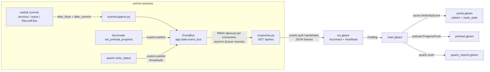

# План перехода на WebSockets

## Контекст

Сейчас фронтенд узнаёт об изменениях данных только через явные перезагрузки и поллинг:
- кэш сущностей (`cache.gleam`) обновляется только по `ReloadX`/`CacheX` после действий самого пользователя; изменения, сделанные RecordFlow, pipeline-задачами или другими пользователями, не видны до ручного обновления (TTL бакетов 60 с работает только при повторном заходе на страницу);
- прогресс preload OHIF поллится таймером (`preload.gleam` → `GET /dicom-web/preload/progress/{task_id}`);
- статус Quarto-рендера поллится каждые 3 с до 200 раз (`pages/admin/quarto_reports.gleam`).

Цель: единое WebSocket-соединение `/api/ws`, по которому сервер пушит события об изменениях сущностей и прогрессе задач. Кэш фронта становится событийным, поллинг уходит (остаётся только как fallback при разрыве WS).

## Ключевые решения (по результатам исследования)

### Авторизация: оставить cookie-сессии, JWT НЕ вводить

Браузерный `WebSocket` handshake — это обычный HTTP GET: cookie `clarinet_session` (HttpOnly, SameSite=Lax) уходит автоматически, т.к. SPA и API живут на одном origin (FastAPI отдаёт бандл; nginx проксирует всё под одним хостом, Upgrade-заголовки уже настроены в `deploy/nginx/clarinet.conf`).

Сравнение по количеству кода:
- **Cookie (выбрано)**: один helper `authenticate_websocket(websocket, session)` (~30 строк), который читает `websocket.cookies[settings.cookie_name]` и переиспользует готовый `DatabaseStrategy.read_token` из `clarinet/api/auth_config.py` (включая его TTL-кэш валидаций). На фронте — **ноль** auth-кода: токен нигде не хранится и не передаётся.
- **JWT**: endpoint выдачи тикета + хранение токена на фронте + передача в query-string (светится в access-логах) или через Sec-WebSocket-Protocol + refresh при reconnect + второй параллельный механизм auth рядом с cookie (HTTP-часть остаётся на сессиях) + потеря мгновенного revoke (вся session-инфраструктура: лимиты, idle timeout, IP-check, CLI `clarinet session revoke-user` — перестаёт действовать на WS).

JWT сократил бы код только при полной миграции всего приложения с DB-сессий на JWT — это потеря функциональности (revoke, лимиты сессий) и отдельный большой проект. Не делаем.

Жизненный цикл долгоживущего соединения:
- при connect: валидация cookie → 403/close до accept, если невалидна;
- ревалидация каждые `ws_revalidate_seconds` (default 300): повторный `read_token`; если сессия истекла/отозвана — сервер шлёт `{"type":"auth_expired"}` и закрывает с кодом 4401; клиент делает `Logout` (существующий flow);
- protocol-ping uvicorn (default 20 с) удерживает соединение живым сквозь nginx `proxy_read_timeout 300s`.

### Клиентский транспорт: свой FFI-модуль `utils/websocket.gleam` (без новых Gleam-зависимостей)

Нативной поддержки клиентских WebSocket в Lustre 5.x нет (проверено по 5.7): официальный гайд по side effects относит их к «effects with multiple dispatch» и предлагает писать через `effect.from` + FFI. Тип `WebSocket` в `lustre/server_component` — это вариант `TransportMethod` для server components (update/view исполняются на Gleam-сервере, по проводу ходит внутренний протокол DOM-патчей) — с FastAPI-бэкендом неприменимо.

Исследование экосистемы:
- **`lustre_websocket` 0.9.0** (hex, апрель 2025, codeberg.org/kero/lustre_websocket) — совместим с lustre 5.x, но выглядит заброшенным (один мейнтейнер, TODO-список не движется); внутри ~50 строк той же обвязки `effect.from` + FFI, которую пишем сами. Не берём.
- `omnimessage_lustre` / `omnimessage_server` — обмен типизированными Lustre-сообщениями клиент↔сервер, но серверная часть рассчитана на Gleam-бэкенд; для Python/FastAPI ценности не добавляет, версия 0.1.x. Не берём.
- `plinth` (уже в зависимостях) WebSocket-биндингов не содержит.

**Выбрано: собственный `src/utils/websocket.gleam` + `src/utils/websocket.ffi.mjs`.** Паттерн идентичен `modem` (официальный пакет lustre-labs: публичная функция принимает `to_msg`-обёртку → `use dispatch <- effect.from` → приватные `do_*` externals с колбэками) и конвенции проекта (`utils/viewer_window.gleam` + `.ffi.mjs`):
- opaque `pub type WebSocket`; события `Connected(WebSocket) | MessageReceived(String) | Closed(code: Int)`; бинарные кадры игнорируются осознанно (протокол текстовый JSON);
- `connect(url, to_msg) -> Effect(msg)` — один эффект, колбэки живут всю жизнь сокета и диспатчат многократно; `send(socket, text)` и `close(socket)` — эффекты с игнорируемым dispatch;
- первой строкой `connect` — guard `use <- bool.guard(!lustre.is_browser(), Nil)` (как в modem): защита gleeunit-тестов от `new WebSocket` вне браузера;
- резолв относительного пути в `ws(s)://host/...` от `location` — в FFI; sub-path деплой работает через `config.base_path() <> "/api/ws"`;
- `Closed(code)` отдаёт close-код наружу: `ws.gleam` различает 4401 (auth — Logout, без reconnect) и остальные коды (reconnect с backoff).

Бэкенд: WebSocket-роуты — это штатный Starlette/FastAPI; нужна лишь зависимость `websockets` (сейчас в pyproject голый `uvicorn>=0.21.1` без extra `[standard]`, ws-протокол не установлен).

### Источник событий: SQLAlchemy after_flush/after_commit, а не ручные publish

Мутации разбросаны (RecordService, StudyService, AdminService, прямые `repo.update_fields` в роутерах — например context_info в `record.py:398`), и ручные publish-вызовы легко забыть. Вместо этого — слушатели на `sqlalchemy.orm.Session` (sync-сессия внутри AsyncSession):
- `after_flush`: для наблюдаемых моделей (`Record`, `Patient`, `Study`, `Series`, `RecordType`, `User`) из `session.new/dirty/deleted` собрать «тонкие» события `{entity, action, id}` (+ для Record — колонки `record_type_name`, `user_id`, доступные без lazy-load) в `session.info["pending_ws_events"]`;
- `after_commit`: передать накопленное в bus; `after_rollback`: очистить.

Это перехватывает в одной точке **все ORM-мутации** (`session.add/delete`, изменение атрибутов загруженных объектов) — независимо от того, выполнил их сервис, прямой `repo.*` или роутер. RecordFlow и pipeline-воркеры мутируют через HTTP API (`ClarinetClient`) → коммиты происходят в том же uvicorn-процессе (он один: `uvicorn.run` в `cli/main.py` без workers) → события не теряются. В процессах TaskIQ-воркеров слушатель срабатывает вхолостую (bus без подключений) — no-op. Три класса мутаций UoW **не** видит — для них точечный явный publish (см. «Границы перехвата» ниже).

События «тонкие» намеренно: ни одного поля данных по WS не передаётся — клиент дотягивает изменённое существующими REST-эндпоинтами под своим RBAC. Это исключает утечку маскируемых данных (`mask_records`) через WS и убирает сериализацию/авторизацию полных объектов.

#### Границы перехвата: что UoW-слушатель НЕ видит

`after_flush` отслеживает только ORM Unit of Work (`session.new/dirty/deleted`). Мутации в обход ORM его минуют — для них **точечный явный publish в data-access слое** (в репозиториях, не в сервисах: «один источник на слой данных» сохраняется, publish не размазывается по бизнес-логике). ORM-каскадов в моделях нет вообще — все FK заданы `ondelete=` на уровне БД, поэтому каскады исполняет СУБД, а не ORM, и для слушателя они невидимы.

| Класс мутации | Пример в коде | Почему невидимо | Обход |
|---|---|---|---|
| **DB-cascade `ON DELETE CASCADE`** | `Patient→Study→Series→Record→RecordFileLink` (`study.py:44/86`, `record.py:191/194/198`, `file_schema.py`) | `session.delete(patient)` эмитит только `DELETE patient`; детей сносит СУБД, в `session.deleted` их нет | explicit `emit_entity(...)` `deleted` для затронутых Study/Series/Record в методах удаления Patient/Study/Series |
| **DB-cascade `ON DELETE SET NULL`** | `Record.parent_record_id` (`record.py:205`) | у дочерних записей `parent_record_id` обнуляется СУБД молча | при необходимости — explicit `record/updated` для осиротевших детей (минорно: parent редко влияет на UI) |
| **Core-bulk DML** | `RecordRepository.delete_many` → `sa_delete(Record).where(id.in_(...))` (`record_repository.py:1124`) | Core-`DELETE`, объекты не проходят через `session.deleted`. Выбрано осознанно — обходит UoW-ordering для self-referential строк | explicit `emit_entity(...)` `record/deleted` прямо в `delete_many` (ids уже на входе) |
| **Raw SQL** | `session.execute(text(...))` (`report_repository.py:83`) | минует ORM целиком | не требуется: отчёты `READ ONLY`, мутаций нет |

Помечать такие call-sites комментарием-маркером `# ws-capture: explicit emit, UoW-invisible`, чтобы новый bulk/каскадный путь не оставался без события молча.

#### Корректность слушателя

- **Savepoint.** `PatientRepository.create` оборачивает вставку в `session.begin_nested()` (retry auto_id, `patient_repository.py:42`). Публиковать **только на внешнем commit**; `after_rollback` чистит **лишь** события своего scope. Иначе откат savepoint при retry либо опубликует несостоявшуюся вставку, либо затрёт легитимные события сессии. Обязателен тест на savepoint-путь.
- **publish не роняет commit.** Тело `after_commit` — в `try/except` с логированием: COMMIT уже состоялся, сбой шины не должен всплыть как ошибка бизнес-операции.
- **Идемпотентность за запрос.** `session.info["pending_ws_events"]` очищается после emit — несколько commit в одной сессии не дублируют события.
- **Только column-атрибуты** в `after_flush` — обращение к relationship даёт `MissingGreenlet`.
- **Детектор рассинхрона аудита.** uow-событие `record`, не покрытое audit-событием в той же транзакции (см. «Совместимость с audit») **и** затронувшее аудируемую колонку (`status`, `user_id`, `data`, `context_info`, факт создания/удаления — производные `started_at`/`finished_at`/`checksum`/`anon_*` НЕ считаются; расширение набора — отдельный PR), означает мутацию мимо `_record_event`. Прод: `logger.warning` (в `try/except`, COMMIT уже состоялся). Тесты: strict-режим `CLARINET_WS_AUDIT_STRICT=1` копит «осиротевшие» события для `assert orphans == []` — забытый эмиттер валит CI.

#### Совместимость с audit-журналами (PR #332 `record_event`, #330 `pipeline_task_run`)

Аудит и WS — один поток изменений, перехваченный на трёх слоях (record_event = Service-layer, pipeline_task_run = TaskIQ-middleware, capture = UoW). Источник делаем **трёхслойным — audit поверх UoW, а не вместо**, чтобы WS не зависел от полноты эмиттеров аудита:

1. **UoW-слой (страховка).** `after_flush` на наблюдаемых моделях даёт тонкое событие при ЛЮБОЙ ORM-мутации — даже если эмиттер аудита забыт.
2. **Audit-обогащение (приоритет).** В `session.new` ловятся вставки `record_event` → `record`-событие с `actor_id` и точным `kind`; вставки/обновления `pipeline_task_run` → `task_progress` для pipeline-задач. Маппинг `kind → action`: `created→created`, `deleted→deleted`, прочее → `updated`; `actor_id → user_id` для RBAC.
3. **Детектор рассинхрона** (см. «Корректность слушателя») — ловит мутации мимо аудита.

**Дедуп (per-transaction).** `record_event` пишется `add()` (flush-only) в **той же** транзакции, что мутация → audit- и uow-событие лягут в один commit. На `after_commit` дедуп по `(entity, id)` (матчинг `record_event.record_key == Record.id`): есть audit → uow-дубль выбрасывается (audit богаче); запись мимо аудита оставляет тонкое uow-событие (+ warning детектора).

**Покрытие.** Трёхслойность — только для `record` (есть и журнал, и ORM-мутация). `pipeline_task_run` наблюдается напрямую (единственный ORM-носитель статуса задачи, fallback-дихотомии нет). `preload`/`quarto` не-ORM → только explicit publish. `patient/study/series/record_type/user` журнала не имеют → чистый UoW.

**Бонусы #332/#330.** `kind="context_info_updated"` и cascade-delete со снапшотом (`delete_record_cascade`) уже инструментированы — слепые пятна «context_info мимо сервиса» и каскадного удаления закрыты на audit-слое (для `record`) без отдельного `emit_entity`. Журналы durable → resync при reconnect может быть точечным catch-up (`record_event` since `<last_id>` вместо InvalidateAll) — опционально, отдельной итерацией.

**Связанность и порядок мержа.** Оба аудита не опциональны в #332/#330, но uow-страховка делает WS работоспособным и без них. Мержить #330/#332 → main первыми, WS-ветка ребейзится поверх; общая поверхность правок — `models/__init__.py`, `api/dependencies.py`, `api/routers/record.py`, `api/CLAUDE.md`, `.claude/rules/api-urls.md`, `tests/utils/urls.py`.

### RBAC-фильтрация на сервере (per-connection)

- superuser / роль `admin` — получают всё;
- события `patient/study/series/user` — только админам (роутеры этих сущностей admin-only);
- события `record` — обычному пользователю, если `record_type_name` входит в его доступные типы (тот же запрос, что у `GET /records/available_types`, вычисляется при connect и обновляется при ревалидации и при событии `record_type`) **или** `event.user_id == connection.user_id`;
- `record_type` — всем аутентифицированным.

## Протокол (текстовые JSON-кадры, server→client; v1 клиент ничего не шлёт)

```json
{"type": "entity", "entity": "record", "action": "created|updated|deleted", "id": "123", "record_type_name": "ct_seg", "user_id": "<uuid>|null"}
{"type": "entity", "entity": "patient|study|series|record_type|user", "action": "...", "id": "<string id/uid/name>"}
{"type": "task_progress", "task": "preload", "task_id": "...", "payload": {...как текущий ответ поллинга...}}
{"type": "task_progress", "task": "quarto_render", "task_id": "<render_id>", "payload": {...}}
{"type": "auth_expired"}
{"type": "ping"}
```
`id` — всегда строка (int рекордов сериализуется строкой; ключи кэша на фронте уже строковые).

## Схема потока



## Изменения: бэкенд

**Новый модуль `clarinet/services/events/`:**
- `models.py` — Pydantic-модели событий (`EntityEvent`, `TaskProgressEvent`) + сериализация в wire-формат.
- `bus.py` — `EventBus`: `register(connection) -> asyncio.Queue` / `unregister`; `publish(event)` (итерация по подключениям, RBAC-предикат, `put_nowait`; переполнение очереди → закрыть соединение как slow consumer — клиент переподключится и сделает resync); `publish_threadsafe(event)` через `loop.call_soon_threadsafe` (для `write_status`, вызываемого из `asyncio.to_thread`). Хранит loop, создаётся в lifespan → `app.state.event_bus`. Shutdown по паттерну re-creatable (см. `clarinet/CLAUDE.md` Lifespan Shutdown Pattern).
- `capture.py` — слушатели `after_flush`/`after_commit`/`after_rollback` (регистрация однократная, идемпотентная), карта наблюдаемых моделей → имя сущности + извлечение колонок. Только column-атрибуты, никаких обращений к relationship (MissingGreenlet). `after_commit` публикует только на внешней транзакции и обёрнут в `try/except`; буфер `session.info` чистится после emit (см. «Корректность слушателя»). Экспортирует хелпер `emit_entity(bus, entity, action, ids)` для явного publish из репозиториев.
- **Явный emit в репозиториях (UoW-invisible пути, см. «Границы перехвата»):** `RecordRepository.delete_many` (`sa_delete`) и методы удаления Patient/Study/Series (DB-каскад) вызывают `emit_entity(...)` после успешного commit, помечены комментарием-маркером. Без этого каскадные/bulk-удаления молча не дают событий.
- **Dual-source (см. «Совместимость с audit»):** наблюдает `record_event`/`pipeline_task_run` (audit-обогащение) поверх наблюдаемых ORM-моделей (uow-страховка); дедуп по `(entity, id)` на `after_commit` с приоритетом audit; детектор рассинхрона пишет warning/strict при мутации аудируемой колонки мимо `record_event`.

**Новый роутер `clarinet/api/routers/ws.py`** — `websocket("/ws")`, монтируется в `app.py` под `/api` (рядом с `health`), условно по `settings.ws_enabled`:
- auth до `accept()` через новый helper `authenticate_websocket()` в `auth_config.py` (читает cookie, переиспользует `DatabaseStrategy.read_token`; сессию БД берёт через `db_manager.get_async_session_context()` и закрывает сразу после валидации — не держать AsyncSession на всё время жизни соединения);
- send-loop: читает свою `asyncio.Queue`, шлёт JSON; раз в 30 с — `{"type":"ping"}`; раз в `ws_revalidate_seconds` — ревалидация токена (свежая короткоживущая сессия БД), при провале `auth_expired` + close(4401);
- receive-loop: дренаж входящих (игнор) для обнаружения disconnect.

**`clarinet/api/auth_config.py`** — добавить `authenticate_websocket(websocket) -> User | None`.

**Публикация прогресса задач (фаза 3):**
- `clarinet/services/dicomweb/cache.py::set_preload_progress` — после записи в TTLCache опубликовать `TaskProgressEvent(task="preload", ...)` адресно пользователю-инициатору (в `start_preload` запоминать `user_id`).
- `clarinet/services/quarto_render.py::write_status` (или его call-sites в `quarto_report_service.py`) — публиковать `task="quarto_render"` админам.

**`clarinet/settings.py`** — `ws_enabled: bool = True`, `ws_revalidate_seconds: int = 300`, `ws_send_queue_size: int = 256`. **`clarinet/api/routers/info.py`** — добавить `ws_enabled` в ответ `/api/info` (фронт не пытается подключаться, если выключено).

**`pyproject.toml`** — добавить `websockets>=12` (uvicorn подхватит протокол автоматически). Stubs у websockets есть, mypy-override не нужен.

Миграций БД нет (схема не меняется).

## Изменения: фронтенд

**Новый `src/utils/websocket.gleam` + `src/utils/websocket.ffi.mjs`** — низкоуровневый транспорт (API и устройство — см. «Клиентский транспорт» выше). FFI: `connect(url, onOpen, onMessage, onClose)` вешает обработчики и зовёт колбэки на каждое событие; `send`/`closeSocket` — однострочники; текст/бинарь различается через `typeof event.data === "string"` (не-строки дропаются).

**Новый `src/ws.gleam`** — самодостаточный MVU-модуль по образцу `preload.gleam` (поверх `utils/websocket`):
- `Model`: `Disconnected | Connecting | Connected(websocket.WebSocket)` + `attempt: Int` + `reconnect_timer`, `watchdog_timer: Option(global.TimerID)`, `last_msg_ms`;
- `connect()` → `websocket.connect(config.base_path() <> "/api/ws", WsEvent)`;
- `Connected(socket)` → OutMsg `Connected` (main запускает resync); `MessageReceived(text)` → decode (`src/api/ws_events.gleam` — декодер wire-формата на `gleam/dynamic/decode`) → OutMsg `EntityEvent(...)` / `TaskProgress(...)` / `AuthExpired`; `Closed(4401)` → OutMsg `AuthExpired` (без reconnect); `Closed(_)` → reconnect с экспоненциальным backoff (1s→2s→…→cap 30s, сброс счётчика после успешного open);
- heartbeat-watchdog: если ни одного кадра (включая ping) за 90 с — принудительный close + reconnect;
- `AuthExpired` → OutMsg, main транслирует в существующий `store.Logout`.

**`store.gleam`** — поле `ws: ws.Model`, Msg `WsMsg(ws.Msg)`; **`main.gleam`**:
- старт соединения после `CheckSessionResult(Ok(user))` и после логина (`SetUser`), если `info.ws_enabled`; остановка (`ws.close`) в `Logout`-ветке;
- делегирование `WsMsg` + трансляция OutMsg: `Connected` → resync (см. ниже), `EntityEvent(e)` → `store.CacheMsg(cache.WsEntityEvent(e))`, `TaskProgress(preload, ...)` → `store.PreloadMsg(preload.ProgressPush(...))`, `TaskProgress(quarto_render, ...)` → делегат в страницу quarto_reports, если открыта.

**`cache.gleam` — событийная организация кэша** (центральная часть):
- новый `Msg`-арм `WsEntityEvent(event)`:
  - `record`: если `id` есть в `model.records` — точечный refetch `GET /records/{id}` и `put_record` (403/404 при refetch → удалить из dict); `action=deleted` → удалить из `records` и из items всех бакетов. Все бакеты `Live/LoadingMore` → `bucket.mark_stale` + **дебаунс-рефетч** (новый таймер-арм `RefetchStaleBuckets`, ~750 мс, один на окно): рефетчатся бакеты в `Stale` — это держит открытые списки живыми без изменений в страницах (они и так рендерятся из `shared.cache`); бакеты со `loaded_at` старше 10 мин не рефетчатся, а выбрасываются из LRU (повторный визит загрузит заново по существующему пути `FetchBucketMsg`). Плюс `InvalidateFilterOptions` и refetch `record_type_stats`, если `Some` (тоже под дебаунс);
  - `patient/study/series/record_type`: если сущность в соответствующем dict — точечный refetch + `put_*`; `deleted` → удалить;
  - `user`: refetch списка пользователей, если dict непустой (события приходят только админам);
- стратегия неизменна для существующих механизмов: TTL 60 с и LRU cap 20 остаются страховкой, `upsert_record_in_buckets` остаётся для локальных оптимистичных мутаций.

**Resync при (пере)подключении** (события за время разрыва потеряны): main по `Connected` диспатчит `InvalidateAllRecordBucketsMsg` + `InvalidateFilterOptions` + повторный `init_page_for_route(model, model.route)` (страница сама перезагрузит то, что показывает). Дёшево и корректно.

**`preload.gleam`** — новый Msg `ProgressPush(task_id, payload)`, обрабатывается тем же кодом, что результат поллинга; таймер поллинга запускается только когда WS не Connected (fallback). **`pages/admin/quarto_reports.gleam`** — аналогично: push-обновление статуса рендера; поллинг-цепочка остаётся как fallback при разрыве.

**Не трогаем**: `SlicerPing` в `records/execute.gleam` — это активная проверка доступности внешнего Slicer, к серверному состоянию отношения не имеет.

## Порядок работ (фазы = последовательные PR-куски в одной ветке)

1. **Зависимости + настройки**: pyproject (`websockets`), settings, `/api/info`.
2. **Бэкенд**: `services/events/` (bus, capture, models) → `authenticate_websocket` → `routers/ws.py` → lifespan/app wiring → тесты.
3. **Фронтенд-ядро**: `utils/websocket.gleam` + `websocket.ffi.mjs`, `api/ws_events.gleam`, `ws.gleam`, wiring в store/main, `cache.WsEntityEvent` + дебаунс-рефетч + resync.
4. **Прогресс задач**: publish в dicomweb preload и quarto write_status; consume в `preload.gleam` и `quarto_reports.gleam`; поллинг переводится в fallback-режим.

## Верификация

- **Бэкенд-тесты** (`tests/test_ws_*.py`, `tests/integration/`): `starlette.testclient.TestClient(app).websocket_connect("/api/ws")` (httpx ASGITransport WS не умеет; sync TestClient — штатный путь): подключение с валидной cookie / отказ без неё; capture: flush Record → событие с правильными `entity/action/id/record_type_name`; rollback → нет событий; **каскадное удаление Patient → события `deleted` для дочерних Study/Series/Record** (явный emit, не UoW); **bulk `delete_many` → `record/deleted`**; **savepoint-retry в `PatientRepository.create` → ровно одно `patient/created`, без ложного на откаченной попытке**; **dual-source A (fallback): мутация аудируемой колонки мимо `RecordService` (`repo.update_fields`) → `record`-событие всё равно приходит**; **B (детектор): тот же путь → WARNING (`caplog`) / strict-список непуст**; **C (дедуп): мутация через `RecordService` → ровно одно событие с `actor_id`, без дубля**; RBAC: обычный пользователь не получает событие чужого типа записи, получает своё/админ получает всё; slow consumer → close.
- **Фронтенд**: `gleam test` — декодер `ws_events`, чистые функции `cache.update` на `WsEntityEvent` (mark_stale, удаление, дебаунс-переходы); `make frontend-check`.
- **Ручная проверка**: `make run-dev`, два окна браузера → смена статуса записи в одном видна во втором без перезагрузки; preload OHIF показывает прогресс без запросов поллинга (вкладка Network); рестарт сервера → фронт переподключается и resync'ается.
- **Прогон**: `./scripts/run_tests.sh -k "ws" -q` → `make check` → `make test-unit`.
- E2E (Playwright, два контекста) — опционально отдельным шагом в `deploy/test/e2e/`, если фазы 1–3 пройдут.

## Риски / ограничения (зафиксировать в коде комментариями где уместно)

- Один uvicorn-процесс — in-process bus достаточен; при переходе на несколько воркеров потребуется внешний fan-out (RabbitMQ уже есть в стеке) — вне рамок, отметить в docstring `bus.py`.
- `after_flush` не должен трогать relationships (MissingGreenlet) — только column-атрибуты.
- **UoW-слепые пятна** (DB-cascade, Core-bulk `sa_delete`, `SET NULL`) закрываются явным `emit_entity` в репозиториях, не слушателем. Регресс-риск: новый bulk/каскадный путь без явного emit молча не даст события — митигация: комментарий-маркер на call-sites + тест на каскадное/bulk-удаление.
- Savepoint (`begin_nested` в `PatientRepository.create`) — публикация только на внешнем commit, иначе ложные/потерянные события.
- **Связанность WS↔audit:** `record`-обогащение и `task_progress` зависят от `record_event`/`pipeline_task_run` (оба не опциональны в #332/#330); uow-страховка + детектор рассинхрона делают WS устойчивым к забытым эмиттерам аудита. Порядок мержа: #330/#332 → main → WS поверх.
- Тонкие события раскрывают факт изменения (id) записей вне роли пользователя только в пределах его отфильтрованных типов — фильтрация по `available_types` это закрывает.
