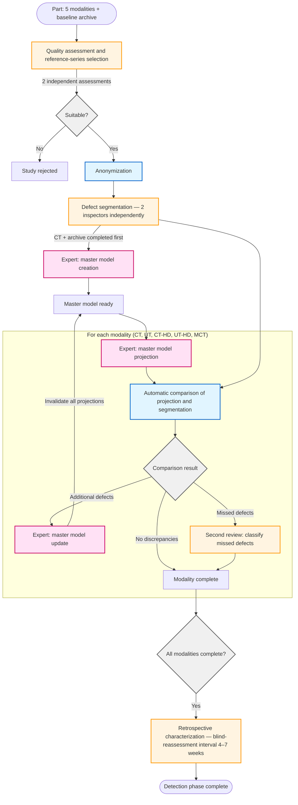
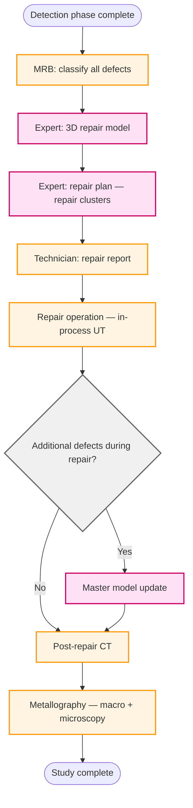

# Workflow diagram — NDT comparative defect-detection study

## Detection phase

## Repair phase

## Legend

- **Blue** (light blue fill) — automatic processes
- **Orange** (yellow fill) — manual processes (inspectors)
- **Pink** — expert tasks
- **Gray** — decision points

## Key workflow features

1. **Parallel modality processing**: all 5 modalities are processed independently
2. **Update loops**: when additional defects are found, the master model is updated and all projections are invalidated
3. **Hash check**: on projection completion, the master model's currency is verified
4. **Double independent assessment**: each segmentation is performed by two inspectors independently
5. **Second review**: separates method limitation (invisible defect) from observer error (missed visible defect)
6. **Blind-reassessment interval**: retrospective characterization is separated from segmentation by a 4–7 week interval
7. **End-to-end master model**: updated at every stage — from detection through in-process repair findings
