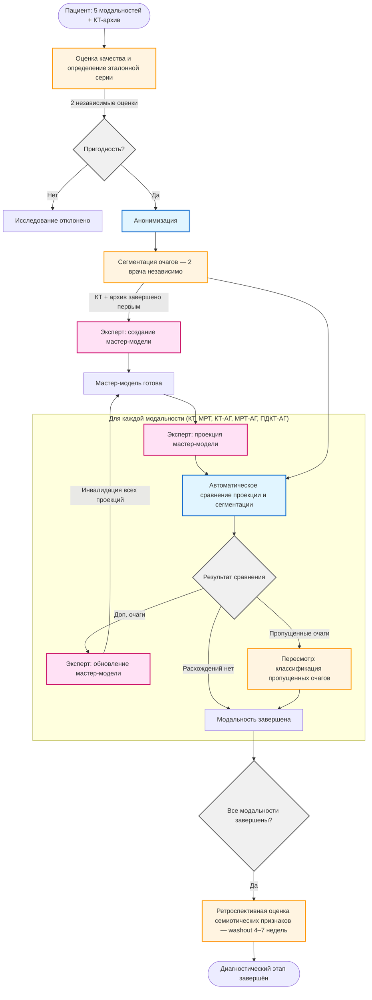
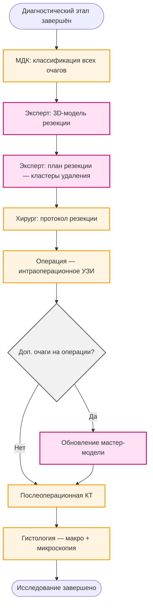

# Workflow диаграмма исследования метастазов печени

## Диагностический этап

## Хирургический этап

## Легенда

- **Синий** (голубой фон) — автоматические процессы
- **Оранжевый** (жёлтый фон) — ручные процессы (врачи)
- **Розовый** — задачи эксперта
- **Серый** — точки принятия решений

## Ключевые особенности workflow

1. **Параллельная обработка модальностей**: все 5 модальностей обрабатываются независимо
2. **Циклы обновления**: при обнаружении дополнительных очагов мастер-модель обновляется и все проекции инвалидируются
3. **Проверка hash**: при завершении проекции проверяется актуальность мастер-модели
4. **Двойная независимая оценка**: каждая сегментация выполняется двумя врачами независимо
5. **Пересмотр**: разделяет ограничение метода (невидимый очаг) и ошибку наблюдателя (пропущенный видимый очаг)
6. **Washout-период**: ретроспективная семиотика отделена от сегментации интервалом 4–7 недель
7. **Сквозная мастер-модель**: обновляется на всех этапах — от диагностики до интраоперационных находок
