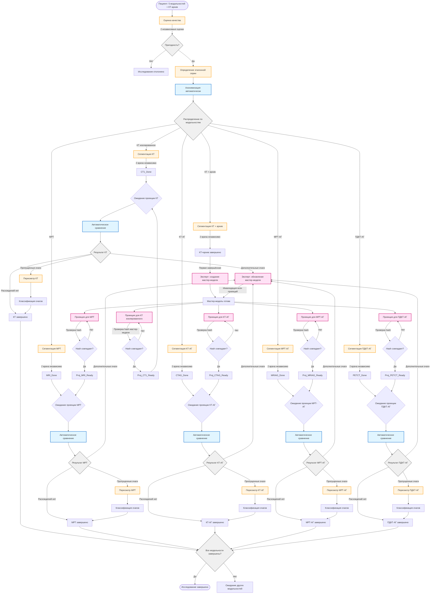

# Workflow диаграмма исследования метастазов печени

## Легенда

- **Синий** (голубой фон) — автоматические процессы
- **Оранжевый** (желтый фон) — ручные процессы (врачи)
- **Розовый** — задачи эксперта
- **Серый** — точки принятия решений

## Ключевые особенности workflow

1. **Параллельная обработка модальностей**: все 5 модальностей (КТ, МРТ, КТ-АГ, МРТ-АГ, ПДКТ-АГ) обрабатываются независимо

2. **Циклы обновления**: при обнаружении дополнительных очагов мастер-модель обновляется, и все проекции инвалидируются

3. **Проверка hash**: при завершении создания проекции проверяется, не изменилась ли мастер-модель

4. **Двойная независимая оценка**: каждая сегментация выполняется двумя врачами независимо

5. **Пересмотр**: врачи пересматривают пропущенные очаги после сравнения с проекцией
