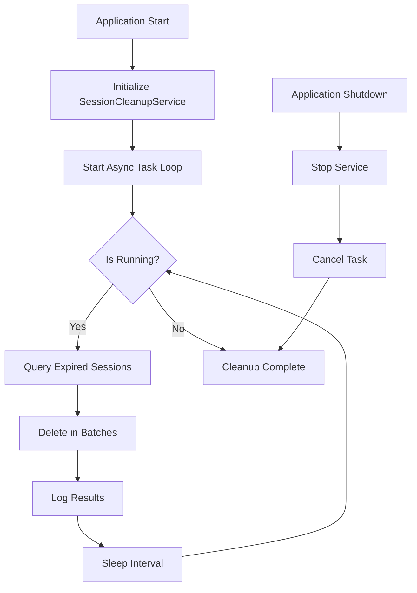

# Authentication System Improvements - Technical Plan

## 1. Executive Summary

The current Clarinet authentication system implements cookie-based session management using fastapi-users with database-backed sessions. While functional, it lacks critical session lifecycle management features that could lead to database bloat, poor user experience, and security vulnerabilities. This document outlines comprehensive improvements to address these issues through proper session expiration, cleanup mechanisms, and enhanced user session restoration.

### Key Problems Identified

- No automatic cleanup of expired sessions leading to unbounded database growth
- Missing session restoration on page reload causing user logout
- Absence of session refresh mechanism for active users
- No expiration tracking in the AccessToken model

### Proposed Solutions Overview

- Implement session expiration with sliding window refresh
- Add background task for periodic session cleanup
- Create session restoration endpoint and frontend integration
- Enhance AccessToken model with proper lifecycle fields

## 2. Current Issues Analysis

### 2.1 Database Bloat - No Session Cleanup

**Impact**: Critical
**Current State**: Sessions accumulate indefinitely in the `AccessToken` table without any cleanup mechanism.

**Technical Details**:
- AccessToken model only tracks `token`, `user_id`, and `created_at`
- No expiration field to determine session validity
- DatabaseStrategy.destroy_token() only called on explicit logout
- No background process to remove stale sessions

**Consequences**:
- Linear database growth with user activity
- Degraded query performance over time
- Potential disk space exhaustion
- Security risk from persistent old sessions

### 2.2 Session Loss on Page Reload
**Impact**: High
**Current State**: Frontend doesn't attempt to restore session state from existing cookies on initialization.

**Technical Details**:
- Frontend `init()` function starts with `user: None`
- No call to `/auth/me` endpoint on app initialization
- Cookie exists but isn't validated until next API call
- User appears logged out despite valid session

**User Experience Impact**:
- Users must re-login after every page refresh
- Loss of application state mid-workflow
- Frustrating experience for long-running tasks

### 2.3 No Session Refresh for Active Users
**Impact**: Medium
**Current State**: Sessions have fixed expiration regardless of user activity.

**Technical Details**:
- `cookie_max_age` set to fixed 24 hours
- No mechanism to extend session during active use
- Active users forcibly logged out after timeout

**Security Considerations**:
- Fixed timeout doesn't distinguish between active and idle sessions
- No protection against session fixation attacks
- Missing "remember me" functionality

### 2.4 Missing Expiration Field in AccessToken
**Impact**: High
**Current State**: AccessToken model lacks expiration tracking.

**Database Schema Gap**:
```python
class AccessToken(SQLModel, table=True):
    token: str  # Primary key
    user_id: UUID  # Foreign key to User
    created_at: datetime  # Creation timestamp
    # MISSING: expires_at field
    # MISSING: last_accessed field
    # MISSING: user_agent field
    # MISSING: ip_address field
```

## 3. Proposed Solutions

### 3.1 Enhanced AccessToken Model

**New Schema Design**:
```python
from datetime import datetime, timedelta
from typing import Optional
from uuid import UUID
from sqlalchemy import Column, ForeignKey, Index
from sqlalchemy.dialects.postgresql import UUID as PG_UUID
from sqlmodel import Field, SQLModel

class AccessToken(SQLModel, table=True):
    """Enhanced session token with lifecycle management."""

    __tablename__ = "access_token"
    __table_args__ = (
        Index("ix_access_token_expires_at", "expires_at"),
        Index("ix_access_token_user_id", "user_id"),
    )

    token: str = Field(primary_key=True, index=True)
    user_id: UUID = Field(
        sa_column=Column(
            PG_UUID(as_uuid=True),
            ForeignKey("user.id", ondelete="CASCADE"),
            nullable=False,
        ),
    )
    created_at: datetime = Field(default_factory=lambda: datetime.now(UTC))
    expires_at: datetime = Field(index=True)  # When session expires
    last_accessed: datetime = Field(default_factory=lambda: datetime.now(UTC))

    # Optional metadata fields
    user_agent: Optional[str] = Field(default=None, max_length=512)
    ip_address: Optional[str] = Field(default=None, max_length=45)  # IPv6 support

    @property
    def is_expired(self) -> bool:
        """Check if session has expired."""
        return datetime.now(UTC) >= self.expires_at

    @property
    def is_active(self) -> bool:
        """Check if session is currently active (accessed recently)."""
        idle_timeout = timedelta(hours=1)  # Configurable
        return datetime.now(UTC) - self.last_accessed < idle_timeout

    def refresh_expiration(self, extend_by: timedelta) -> None:
        """Extend session expiration for active users."""
        self.last_accessed = datetime.now(UTC)
        new_expiry = datetime.now(UTC) + extend_by
        if new_expiry > self.expires_at:
            self.expires_at = new_expiry
```

### 3.2 Enhanced DatabaseStrategy with Expiration

**Updated Implementation**:
```python
from datetime import datetime, timedelta, UTC
from typing import Optional
from uuid import uuid4

from fastapi import Request
from fastapi_users import BaseUserManager
from fastapi_users.authentication import Strategy
from sqlalchemy import delete, select
from sqlalchemy.ext.asyncio import AsyncSession

from src.models.auth import AccessToken
from src.models.user import User
from src.settings import settings
from src.utils.logger import logger

class DatabaseStrategy(Strategy[User, UUID]):
    """Enhanced database strategy with session lifecycle management."""

    def __init__(self, session: AsyncSession, request: Optional[Request] = None):
        self.session = session
        self.request = request

    async def write_token(self, user: User) -> str:
        """Create new session with expiration."""
        token = str(uuid4())
        expires_at = datetime.now(UTC) + timedelta(
            hours=settings.session_expire_hours
        )

        # Extract metadata from request if available
        user_agent = None
        ip_address = None
        if self.request:
            user_agent = self.request.headers.get("User-Agent", "")[:512]
            ip_address = self.request.client.host if self.request.client else None

        access_token = AccessToken(
            token=token,
            user_id=user.id,
            expires_at=expires_at,
            user_agent=user_agent,
            ip_address=ip_address,
        )

        self.session.add(access_token)
        await self.session.commit()

        logger.info(
            f"Session created for user {user.id}, expires at {expires_at}"
        )
        return token

    async def read_token(
        self, token: Optional[str], user_manager: BaseUserManager[User, UUID]
    ) -> Optional[User]:
        """Validate token and check expiration."""
        if not token:
            return None

        # Query token with expiration check
        statement = select(AccessToken).where(
            AccessToken.token == token,
            AccessToken.expires_at > datetime.now(UTC)
        )
        result = await self.session.execute(statement)
        access_token = result.scalar_one_or_none()

        if not access_token:
            return None

        # Update last accessed time for sliding expiration
        if settings.session_sliding_refresh:
            access_token.last_accessed = datetime.now(UTC)

            # Extend expiration if more than halfway through
            time_left = access_token.expires_at - datetime.now(UTC)
            total_duration = timedelta(hours=settings.session_expire_hours)

            if time_left < total_duration / 2:
                access_token.expires_at = datetime.now(UTC) + total_duration
                logger.debug(f"Extended session {token[:8]}... expiration")

            await self.session.commit()

        # Get and return user
        user_statement = select(User).where(User.id == access_token.user_id)
        user_result = await self.session.execute(user_statement)
        return user_result.scalar_one_or_none()

    async def destroy_token(self, token: str, user: User) -> None:
        """Remove session on logout."""
        statement = delete(AccessToken).where(AccessToken.token == token)
        await self.session.execute(statement)
        await self.session.commit()
        logger.info(f"Session destroyed for user {user.id}")
```

### 3.3 Session Cleanup Background Service

**Implementation**:
```python
# src/services/session_cleanup.py
import asyncio
from datetime import datetime, timedelta, UTC
from typing import Optional

from sqlalchemy import delete, select, func
from sqlalchemy.ext.asyncio import AsyncSession

from src.models.auth import AccessToken
from src.settings import settings
from src.utils.database import get_async_session
from src.utils.logger import logger

class SessionCleanupService:
    """Background service for cleaning expired sessions."""

    def __init__(
        self,
        cleanup_interval: int = 3600,  # Run every hour
        batch_size: int = 1000
    ):
        self.cleanup_interval = cleanup_interval
        self.batch_size = batch_size
        self.is_running = False
        self._task: Optional[asyncio.Task] = None

    async def start(self) -> None:
        """Start the cleanup service."""
        if self.is_running:
            logger.warning("Session cleanup service already running")
            return

        self.is_running = True
        self._task = asyncio.create_task(self._cleanup_loop())
        logger.info("Session cleanup service started")

    async def stop(self) -> None:
        """Stop the cleanup service."""
        self.is_running = False
        if self._task:
            self._task.cancel()
            try:
                await self._task
            except asyncio.CancelledError:
                pass
        logger.info("Session cleanup service stopped")

    async def _cleanup_loop(self) -> None:
        """Main cleanup loop."""
        while self.is_running:
            try:
                await self._perform_cleanup()
                await asyncio.sleep(self.cleanup_interval)
            except Exception as e:
                logger.error(f"Error in session cleanup: {e}")
                await asyncio.sleep(60)  # Retry after 1 minute on error

    async def _perform_cleanup(self) -> None:
        """Perform the actual cleanup."""
        async for session in get_async_session():
            try:
                # Count expired sessions
                count_stmt = select(func.count()).select_from(AccessToken).where(
                    AccessToken.expires_at <= datetime.now(UTC)
                )
                result = await session.execute(count_stmt)
                expired_count = result.scalar() or 0

                if expired_count == 0:
                    logger.debug("No expired sessions to clean")
                    return

                logger.info(f"Found {expired_count} expired sessions to clean")

                # Delete in batches to avoid locking
                deleted_total = 0
                while deleted_total < expired_count:
                    # Delete batch of expired sessions
                    delete_stmt = delete(AccessToken).where(
                        AccessToken.expires_at <= datetime.now(UTC)
                    ).limit(self.batch_size)

                    result = await session.execute(delete_stmt)
                    await session.commit()

                    deleted_count = result.rowcount
                    deleted_total += deleted_count

                    if deleted_count == 0:
                        break

                    logger.debug(f"Deleted {deleted_count} expired sessions")

                    # Small delay between batches
                    if deleted_total < expired_count:
                        await asyncio.sleep(0.1)

                logger.info(f"Cleanup completed: removed {deleted_total} sessions")

                # Also clean very old sessions (e.g., older than 30 days)
                cutoff_date = datetime.now(UTC) - timedelta(days=30)
                old_stmt = delete(AccessToken).where(
                    AccessToken.created_at < cutoff_date
                )
                result = await session.execute(old_stmt)
                await session.commit()

                if result.rowcount > 0:
                    logger.info(f"Removed {result.rowcount} ancient sessions")

            except Exception as e:
                logger.error(f"Failed to perform cleanup: {e}")
                await session.rollback()
                raise
            finally:
                await session.close()

# Global service instance
session_cleanup_service = SessionCleanupService(
    cleanup_interval=settings.session_cleanup_interval,
    batch_size=settings.session_cleanup_batch_size
)
```

### 3.4 Session Restoration API Endpoint

**New Endpoint Implementation**:
```python
# src/api/routers/auth.py - Addition
from fastapi import APIRouter, Cookie, Depends, HTTPException
from typing import Optional

from src.api.auth_config import get_database_strategy, current_active_user
from src.models.user import User, UserRead
from src.utils.database import get_async_session

router = APIRouter(tags=["auth"])

@router.get("/session/validate", response_model=UserRead)
async def validate_session(
    session_token: Optional[str] = Cookie(
        None,
        alias=settings.cookie_name
    ),
    session: AsyncSession = Depends(get_async_session)
) -> User:
    """
    Validate existing session from cookie.
    Used by frontend to restore session on page load.
    """
    if not session_token:
        raise HTTPException(status_code=401, detail="No session cookie found")

    strategy = DatabaseStrategy(session)
    user = await strategy.read_token(session_token, None)

    if not user:
        raise HTTPException(status_code=401, detail="Invalid or expired session")

    if not user.is_active:
        raise HTTPException(status_code=403, detail="User account is inactive")

    return user

@router.post("/session/refresh")
async def refresh_session(
    user: User = Depends(current_active_user),
    session: AsyncSession = Depends(get_async_session)
) -> dict:
    """
    Explicitly refresh the current session expiration.
    Useful for "keep me logged in" functionality.
    """
    # Get current session token from request
    token = ...  # Extract from cookie

    stmt = select(AccessToken).where(
        AccessToken.token == token,
        AccessToken.user_id == user.id
    )
    result = await session.execute(stmt)
    access_token = result.scalar_one_or_none()

    if not access_token:
        raise HTTPException(status_code=401, detail="Session not found")

    # Extend expiration
    new_expiry = datetime.now(UTC) + timedelta(hours=settings.session_expire_hours)
    access_token.expires_at = new_expiry
    access_token.last_accessed = datetime.now(UTC)

    await session.commit()

    return {
        "expires_at": new_expiry.isoformat(),
        "extended_by_hours": settings.session_expire_hours
    }

@router.get("/sessions/active", response_model=List[SessionInfo])
async def get_active_sessions(
    user: User = Depends(current_active_user),
    session: AsyncSession = Depends(get_async_session)
) -> List[SessionInfo]:
    """
    Get all active sessions for the current user.
    Allows users to see and manage their sessions.
    """
    stmt = select(AccessToken).where(
        AccessToken.user_id == user.id,
        AccessToken.expires_at > datetime.now(UTC)
    ).order_by(AccessToken.last_accessed.desc())

    result = await session.execute(stmt)
    sessions = result.scalars().all()

    return [
        SessionInfo(
            token_preview=token.token[:8] + "...",
            created_at=token.created_at,
            expires_at=token.expires_at,
            last_accessed=token.last_accessed,
            user_agent=token.user_agent,
            ip_address=token.ip_address,
            is_current=token.token == current_token  # Mark current session
        )
        for token in sessions
    ]

@router.delete("/sessions/{token_preview}")
async def revoke_session(
    token_preview: str,
    user: User = Depends(current_active_user),
    session: AsyncSession = Depends(get_async_session)
) -> dict:
    """Revoke a specific session."""
    # Implementation for security management
    pass
```

### 3.5 Frontend Session Restoration

**Enhanced Frontend Initialization**:
```gleam
// src/frontend/src/main.gleam - Enhanced init
import api/auth
import gleam/javascript/promise
import lustre/effect.{type Effect}

fn init(_flags) -> #(Model, Effect(Msg)) {
  let model = store.init()

  // Set up routing
  let initial_route = case modem.initial_uri() {
    Ok(uri) -> router.parse_route(uri)
    Error(_) -> router.Home
  }

  let model_with_route = store.set_route(model, initial_route)

  // Combine effects: routing setup + session restoration
  let effects = effect.batch([
    modem.init(on_url_change),
    restore_session_effect()
  ])

  #(model_with_route, effects)
}

fn restore_session_effect() -> Effect(Msg) {
  effect.from(fn(dispatch) {
    // Attempt to validate existing session
    auth.validate_session()
    |> promise.tap(fn(result) {
      case result {
        Ok(user) -> {
          // Session is valid, restore user state
          dispatch(store.SessionRestored(user))
        }
        Error(_) -> {
          // No valid session or error, continue as guest
          dispatch(store.NoOp)
        }
      }
    })
    Nil
  })
}

// New API function in auth.gleam
pub fn validate_session() -> Promise(Result(User, ApiError)) {
  http_client.get("/auth/session/validate")
  |> promise.map(fn(result) { result.try(result, decode_user) })
}

// New message in store.gleam
pub type Msg {
  // ... existing messages ...
  SessionRestored(user: User)
  SessionRefreshRequested
  SessionRefreshed(Result(Nil, ApiError))
}

// Handle in update function
pub fn update(model: Model, msg: Msg) -> #(Model, Effect(Msg)) {
  case msg {
    store.SessionRestored(user) -> {
      let new_model = model
        |> store.set_user(user)
        |> store.set_loading(False)

      // Navigate to intended route or dashboard
      case model.route {
        router.Login | router.Register ->
          #(store.set_route(new_model, router.Home), effect.none())
        _ -> #(new_model, effect.none())
      }
    }

    store.SessionRefreshRequested -> {
      // Explicit session refresh (e.g., from "keep me logged in" button)
      let refresh_effect = effect.from(fn(dispatch) {
        auth.refresh_session()
        |> promise.tap(fn(result) {
          dispatch(store.SessionRefreshed(result))
        })
        Nil
      })
      #(model, refresh_effect)
    }

    // ... other cases ...
  }
}
```

## 4. Implementation Phases

### Phase 1: Critical Database Changes (Priority: Critical)
**Duration**: 1-2 days
**Dependencies**: None

1. Create enhanced AccessToken model with expiration fields
2. Generate Alembic migration for schema changes
3. Update existing sessions with default expiration
4. Deploy database changes

**Migration Script**:
```python
"""Add session lifecycle fields to access_token table

Revision ID: xxx
Create Date: 2025-01-23
"""
from alembic import op
import sqlalchemy as sa
from datetime import datetime, timedelta, UTC

def upgrade() -> None:
    # Add new columns
    op.add_column('access_token',
        sa.Column('expires_at', sa.DateTime(), nullable=True))
    op.add_column('access_token',
        sa.Column('last_accessed', sa.DateTime(), nullable=True))
    op.add_column('access_token',
        sa.Column('user_agent', sa.String(512), nullable=True))
    op.add_column('access_token',
        sa.Column('ip_address', sa.String(45), nullable=True))

    # Create indexes
    op.create_index('ix_access_token_expires_at', 'access_token', ['expires_at'])

    # Update existing rows with default values
    connection = op.get_bind()
    default_expiry = datetime.now(UTC) + timedelta(days=7)
    connection.execute(
        sa.text("UPDATE access_token SET expires_at = :expiry WHERE expires_at IS NULL"),
        {"expiry": default_expiry}
    )
    connection.execute(
        sa.text("UPDATE access_token SET last_accessed = created_at WHERE last_accessed IS NULL")
    )

    # Make expires_at non-nullable after data migration
    op.alter_column('access_token', 'expires_at', nullable=False)

def downgrade() -> None:
    op.drop_index('ix_access_token_expires_at')
    op.drop_column('access_token', 'expires_at')
    op.drop_column('access_token', 'last_accessed')
    op.drop_column('access_token', 'user_agent')
    op.drop_column('access_token', 'ip_address')
```

### Phase 2: Core Session Management (Priority: High)
**Duration**: 2-3 days
**Dependencies**: Phase 1

1. Implement enhanced DatabaseStrategy with expiration checks
2. Add session validation endpoint
3. Implement session refresh mechanism
4. Update authentication configuration
5. Add comprehensive logging

### Phase 3: Frontend Integration (Priority: High)
**Duration**: 1-2 days
**Dependencies**: Phase 2

1. Add session restoration on app initialization
2. Implement auto-refresh for active sessions
3. Add session management UI components
4. Handle session expiration gracefully
5. Add "Remember me" functionality

### Phase 4: Background Services (Priority: Medium)
**Duration**: 1-2 days
**Dependencies**: Phase 2

1. Implement SessionCleanupService
2. Integrate with application lifecycle
3. Add monitoring and metrics
4. Configure cleanup parameters
5. Add admin tools for manual cleanup

## 5. Technical Specifications

### 5.1 Database Schema Changes

| Field | Type | Nullable | Indexed | Description |
|-------|------|----------|---------|-------------|
| token | VARCHAR(36) | No | Yes (PK) | Session identifier (UUID4) |
| user_id | UUID | No | Yes | Foreign key to user table |
| created_at | TIMESTAMP | No | No | Session creation time |
| expires_at | TIMESTAMP | No | Yes | When session expires |
| last_accessed | TIMESTAMP | No | No | Last activity timestamp |
| user_agent | VARCHAR(512) | Yes | No | Browser/client identifier |
| ip_address | VARCHAR(45) | Yes | No | Client IP (IPv4/IPv6) |

### 5.2 API Endpoints

| Endpoint | Method | Authentication | Description |
|----------|--------|----------------|-------------|
| `/auth/session/validate` | GET | Cookie | Validate existing session |
| `/auth/session/refresh` | POST | Required | Extend session expiration |
| `/auth/sessions/active` | GET | Required | List user's active sessions |
| `/auth/sessions/{id}` | DELETE | Required | Revoke specific session |

### 5.3 Configuration Parameters

```python
# src/settings.py additions
class Settings(BaseSettings):
    # ... existing settings ...

    # Session management
    session_expire_hours: int = 24
    session_sliding_refresh: bool = True  # Auto-extend on activity
    session_absolute_timeout_days: int = 30  # Maximum session age
    session_idle_timeout_minutes: int = 60  # Inactivity timeout

    # Cleanup service
    session_cleanup_enabled: bool = True
    session_cleanup_interval: int = 3600  # Run every hour
    session_cleanup_batch_size: int = 1000
    session_cleanup_retention_days: int = 30

    # Security
    session_concurrent_limit: int = 5  # Max sessions per user
    session_ip_check: bool = False  # Validate IP consistency
    session_secure_cookie: bool = True  # HTTPS only in production
```

### 5.4 Background Service Architecture



## 6. Code Examples

### 6.1 Complete Enhanced DatabaseStrategy

```python
from datetime import datetime, timedelta, UTC
from typing import Optional
from uuid import uuid4

from fastapi import Depends, Request
from fastapi_users import BaseUserManager
from fastapi_users.authentication import Strategy
from sqlalchemy import delete, select, update
from sqlalchemy.ext.asyncio import AsyncSession

from src.exceptions.http import UNAUTHORIZED
from src.models.auth import AccessToken
from src.models.user import User
from src.settings import settings
from src.utils.logger import logger

class DatabaseStrategy(Strategy[User, UUID]):
    """
    Enhanced database strategy with comprehensive session management.

    Features:
    - Automatic expiration checking
    - Sliding window refresh
    - Metadata tracking
    - Concurrent session limits
    """

    def __init__(self, session: AsyncSession, request: Optional[Request] = None):
        self.session = session
        self.request = request

    async def write_token(self, user: User) -> str:
        """Create new session with lifecycle management."""
        # Check concurrent session limit
        if settings.session_concurrent_limit > 0:
            await self._enforce_session_limit(user.id)

        token = str(uuid4())
        expires_at = datetime.now(UTC) + timedelta(
            hours=settings.session_expire_hours
        )

        # Extract request metadata
        user_agent = None
        ip_address = None
        if self.request:
            user_agent = self.request.headers.get("User-Agent", "")[:512]
            if self.request.client:
                ip_address = self.request.client.host

        access_token = AccessToken(
            token=token,
            user_id=user.id,
            expires_at=expires_at,
            user_agent=user_agent,
            ip_address=ip_address,
        )

        self.session.add(access_token)
        await self.session.commit()

        logger.info(
            f"Session created for user {user.id}",
            extra={
                "user_id": str(user.id),
                "expires_at": expires_at.isoformat(),
                "ip_address": ip_address,
            }
        )

        return token

    async def read_token(
        self, token: Optional[str], user_manager: BaseUserManager[User, UUID]
    ) -> Optional[User]:
        """
        Validate token with comprehensive checks.

        Checks performed:
        1. Token exists
        2. Token not expired
        3. User exists and is active
        4. Optional: IP address consistency
        5. Optional: Sliding refresh
        """
        if not token:
            return None

        # Query token with expiration check
        stmt = select(AccessToken).where(
            AccessToken.token == token,
            AccessToken.expires_at > datetime.now(UTC)
        )
        result = await self.session.execute(stmt)
        access_token = result.scalar_one_or_none()

        if not access_token:
            logger.debug(f"Token {token[:8]}... not found or expired")
            return None

        # Optional IP validation
        if settings.session_ip_check and self.request:
            request_ip = self.request.client.host if self.request.client else None
            if access_token.ip_address and request_ip != access_token.ip_address:
                logger.warning(
                    f"IP mismatch for token {token[:8]}...: "
                    f"{request_ip} != {access_token.ip_address}"
                )
                return None

        # Check idle timeout
        if settings.session_idle_timeout_minutes > 0:
            idle_duration = datetime.now(UTC) - access_token.last_accessed
            max_idle = timedelta(minutes=settings.session_idle_timeout_minutes)
            if idle_duration > max_idle:
                logger.info(f"Session {token[:8]}... expired due to inactivity")
                return None

        # Update last accessed and optionally refresh
        access_token.last_accessed = datetime.now(UTC)

        if settings.session_sliding_refresh:
            time_left = access_token.expires_at - datetime.now(UTC)
            total_duration = timedelta(hours=settings.session_expire_hours)

            # Refresh if less than 50% time remaining
            if time_left < total_duration / 2:
                new_expiry = datetime.now(UTC) + total_duration

                # Check absolute timeout
                if settings.session_absolute_timeout_days > 0:
                    max_age = timedelta(days=settings.session_absolute_timeout_days)
                    absolute_limit = access_token.created_at + max_age
                    new_expiry = min(new_expiry, absolute_limit)

                access_token.expires_at = new_expiry
                logger.debug(
                    f"Extended session {token[:8]}... to {new_expiry.isoformat()}"
                )

        await self.session.commit()

        # Get user
        user_stmt = select(User).where(User.id == access_token.user_id)
        user_result = await self.session.execute(user_stmt)
        user = user_result.scalar_one_or_none()

        if not user or not user.is_active:
            logger.warning(f"User {access_token.user_id} not found or inactive")
            return None

        return user

    async def destroy_token(self, token: str, user: User) -> None:
        """Remove session on logout."""
        stmt = delete(AccessToken).where(AccessToken.token == token)
        result = await self.session.execute(stmt)
        await self.session.commit()

        if result.rowcount > 0:
            logger.info(
                f"Session destroyed for user {user.id}",
                extra={"user_id": str(user.id), "token_preview": token[:8] + "..."}
            )

    async def _enforce_session_limit(self, user_id: UUID) -> None:
        """Enforce maximum concurrent sessions per user."""
        # Count active sessions
        count_stmt = select(func.count()).select_from(AccessToken).where(
            AccessToken.user_id == user_id,
            AccessToken.expires_at > datetime.now(UTC)
        )
        result = await self.session.execute(count_stmt)
        session_count = result.scalar() or 0

        if session_count >= settings.session_concurrent_limit:
            # Remove oldest sessions
            excess = session_count - settings.session_concurrent_limit + 1

            # Get oldest sessions
            oldest_stmt = select(AccessToken.token).where(
                AccessToken.user_id == user_id,
                AccessToken.expires_at > datetime.now(UTC)
            ).order_by(AccessToken.created_at).limit(excess)

            result = await self.session.execute(oldest_stmt)
            old_tokens = [row[0] for row in result]

            # Delete them
            if old_tokens:
                delete_stmt = delete(AccessToken).where(
                    AccessToken.token.in_(old_tokens)
                )
                await self.session.execute(delete_stmt)
                logger.info(
                    f"Removed {len(old_tokens)} old sessions for user {user_id} "
                    f"(limit: {settings.session_concurrent_limit})"
                )
```

## 7. Migration Plan

### 7.1 Database Migration Steps

1. **Backup existing data**
   ```sql
   -- Create backup of current access_token table
   CREATE TABLE access_token_backup AS SELECT * FROM access_token;
   ```

2. **Apply schema migration**
   ```bash
   alembic revision --autogenerate -m "Add session lifecycle fields"
   alembic upgrade head
   ```

3. **Populate default values**
   ```sql
   -- Set reasonable defaults for existing sessions
   UPDATE access_token
   SET expires_at = created_at + INTERVAL '7 days'
   WHERE expires_at IS NULL;

   UPDATE access_token
   SET last_accessed = created_at
   WHERE last_accessed IS NULL;
   ```

4. **Verify migration**
   ```python
   # Verification script
   async def verify_migration():
       async with get_async_session() as session:
           # Check all sessions have expiration
           stmt = select(func.count()).select_from(AccessToken).where(
               AccessToken.expires_at.is_(None)
           )
           result = await session.execute(stmt)
           null_count = result.scalar()
           assert null_count == 0, f"Found {null_count} sessions without expiration"
   ```

### 7.2 Rollout Strategy

1. **Phase 1: Deploy database changes** (No breaking changes)
   - Add new columns with defaults
   - Existing code continues to work

2. **Phase 2: Deploy updated backend** (Backward compatible)
   - New strategy uses expiration if present
   - Falls back to old behavior if not

3. **Phase 3: Deploy frontend updates** (Progressive enhancement)
   - Add session restoration
   - Gracefully handle old sessions

4. **Phase 4: Enable cleanup service** (Safe activation)
   - Start with long retention period
   - Gradually reduce as confidence grows

### 7.3 Backward Compatibility

```python
# Compatibility wrapper for transition period
class CompatibleDatabaseStrategy(DatabaseStrategy):
    """Strategy that works with both old and new schema."""

    async def read_token(self, token: Optional[str], user_manager):
        if not token:
            return None

        # Try new schema first
        stmt = select(AccessToken).where(AccessToken.token == token)
        result = await self.session.execute(stmt)
        access_token = result.scalar_one_or_none()

        if not access_token:
            return None

        # Check if new fields exist
        if hasattr(access_token, 'expires_at') and access_token.expires_at:
            # Use new expiration logic
            if access_token.expires_at <= datetime.now(UTC):
                return None
        # Otherwise, fall back to old behavior (no expiration)

        # Continue with user lookup...
```

## 8. Testing Strategy

### 8.1 Unit Tests

```python
# tests/test_session_management.py
import pytest
from datetime import datetime, timedelta, UTC
from uuid import uuid4

from src.models.auth import AccessToken
from src.api.auth_config import DatabaseStrategy

@pytest.mark.asyncio
async def test_session_expiration(async_session, test_user):
    """Test that expired sessions are not valid."""
    strategy = DatabaseStrategy(async_session)

    # Create expired session
    expired_token = AccessToken(
        token=str(uuid4()),
        user_id=test_user.id,
        expires_at=datetime.now(UTC) - timedelta(hours=1)
    )
    async_session.add(expired_token)
    await async_session.commit()

    # Should return None for expired token
    result = await strategy.read_token(expired_token.token, None)
    assert result is None

@pytest.mark.asyncio
async def test_session_sliding_refresh(async_session, test_user, settings):
    """Test sliding window refresh extends expiration."""
    settings.session_sliding_refresh = True
    settings.session_expire_hours = 24

    strategy = DatabaseStrategy(async_session)

    # Create session near expiration
    token_str = str(uuid4())
    near_expiry = datetime.now(UTC) + timedelta(hours=8)  # Less than 50%

    token = AccessToken(
        token=token_str,
        user_id=test_user.id,
        expires_at=near_expiry
    )
    async_session.add(token)
    await async_session.commit()

    # Read token should trigger refresh
    result = await strategy.read_token(token_str, None)
    assert result is not None

    # Check expiration was extended
    refreshed = await async_session.get(AccessToken, token_str)
    assert refreshed.expires_at > near_expiry

@pytest.mark.asyncio
async def test_concurrent_session_limit(async_session, test_user, settings):
    """Test enforcement of concurrent session limits."""
    settings.session_concurrent_limit = 2

    strategy = DatabaseStrategy(async_session)

    # Create 3 sessions
    tokens = []
    for _ in range(3):
        token = await strategy.write_token(test_user)
        tokens.append(token)

    # Check only 2 sessions remain
    stmt = select(func.count()).select_from(AccessToken).where(
        AccessToken.user_id == test_user.id
    )
    result = await async_session.execute(stmt)
    count = result.scalar()

    assert count == 2
    # First token should be deleted
    assert not await async_session.get(AccessToken, tokens[0])
```

### 8.2 Integration Tests

```python
# tests/integration/test_session_api.py
@pytest.mark.asyncio
async def test_session_restoration(async_client, test_user):
    """Test session restoration on app reload."""
    # Login first
    response = await async_client.post(
        "/auth/login",
        data={"username": test_user.email, "password": "password"}
    )
    assert response.status_code == 200

    # Extract cookie
    cookies = response.cookies

    # Validate session with cookie
    response = await async_client.get(
        "/auth/session/validate",
        cookies=cookies
    )
    assert response.status_code == 200
    assert response.json()["id"] == str(test_user.id)

@pytest.mark.asyncio
async def test_session_cleanup_service(async_session):
    """Test cleanup service removes expired sessions."""
    from src.services.session_cleanup import SessionCleanupService

    # Create mix of expired and valid sessions
    now = datetime.now(UTC)
    for i in range(10):
        token = AccessToken(
            token=str(uuid4()),
            user_id=uuid4(),
            expires_at=now - timedelta(hours=i) if i < 5 else now + timedelta(hours=i)
        )
        async_session.add(token)
    await async_session.commit()

    # Run cleanup
    service = SessionCleanupService()
    await service._perform_cleanup()

    # Check only valid sessions remain
    stmt = select(func.count()).select_from(AccessToken)
    result = await async_session.execute(stmt)
    remaining = result.scalar()

    assert remaining == 5  # Only non-expired remain
```

### 8.3 Performance Tests

```python
# tests/performance/test_session_scale.py
@pytest.mark.asyncio
async def test_cleanup_performance(async_session):
    """Test cleanup performance with large number of sessions."""
    import time

    # Create 10,000 expired sessions
    sessions = []
    for i in range(10000):
        sessions.append(AccessToken(
            token=str(uuid4()),
            user_id=uuid4(),
            expires_at=datetime.now(UTC) - timedelta(hours=1)
        ))

    async_session.add_all(sessions)
    await async_session.commit()

    # Measure cleanup time
    service = SessionCleanupService(batch_size=1000)
    start = time.time()
    await service._perform_cleanup()
    duration = time.time() - start

    # Should complete in reasonable time
    assert duration < 10  # Less than 10 seconds for 10k sessions

    # All should be cleaned
    stmt = select(func.count()).select_from(AccessToken)
    result = await async_session.execute(stmt)
    assert result.scalar() == 0
```

## 9. Monitoring and Maintenance

### 9.1 Metrics to Track

```python
# src/utils/metrics.py
from prometheus_client import Counter, Gauge, Histogram

# Session metrics
session_created = Counter(
    'session_created_total',
    'Total number of sessions created',
    ['user_type']
)

session_destroyed = Counter(
    'session_destroyed_total',
    'Total number of sessions destroyed',
    ['reason']  # logout, expired, limit_exceeded
)

active_sessions = Gauge(
    'active_sessions',
    'Number of currently active sessions'
)

session_duration = Histogram(
    'session_duration_seconds',
    'Duration of user sessions',
    buckets=(60, 300, 900, 3600, 7200, 14400, 28800, 86400)
)

cleanup_duration = Histogram(
    'session_cleanup_duration_seconds',
    'Time taken for session cleanup'
)

cleanup_sessions_removed = Counter(
    'session_cleanup_removed_total',
    'Total sessions removed by cleanup'
)
```

### 9.2 Admin Utilities

```python
# src/cli/session_management.py
import click
from datetime import datetime, timedelta, UTC

@click.group()
def session():
    """Session management commands."""
    pass

@session.command()
@click.option('--days', default=30, help='Remove sessions older than N days')
async def cleanup(days: int):
    """Manual session cleanup."""
    async with get_async_session() as session:
        cutoff = datetime.now(UTC) - timedelta(days=days)
        stmt = delete(AccessToken).where(AccessToken.created_at < cutoff)
        result = await session.execute(stmt)
        await session.commit()
        click.echo(f"Removed {result.rowcount} old sessions")

@session.command()
async def stats():
    """Show session statistics."""
    async with get_async_session() as session:
        # Total sessions
        total_stmt = select(func.count()).select_from(AccessToken)
        total = await session.scalar(total_stmt)

        # Active sessions
        active_stmt = select(func.count()).select_from(AccessToken).where(
            AccessToken.expires_at > datetime.now(UTC)
        )
        active = await session.scalar(active_stmt)

        # Expired sessions
        expired = total - active

        click.echo(f"Total sessions: {total}")
        click.echo(f"Active sessions: {active}")
        click.echo(f"Expired sessions: {expired}")

@session.command()
@click.argument('user_id')
async def revoke_user_sessions(user_id: str):
    """Revoke all sessions for a specific user."""
    async with get_async_session() as session:
        stmt = delete(AccessToken).where(AccessToken.user_id == UUID(user_id))
        result = await session.execute(stmt)
        await session.commit()
        click.echo(f"Revoked {result.rowcount} sessions for user {user_id}")
```

### 9.3 Troubleshooting Guide

#### Common Issues and Solutions

| Issue | Symptoms | Solution |
|-------|----------|----------|
| Sessions expiring too quickly | Users logged out frequently | Increase `session_expire_hours`, enable sliding refresh |
| Database growing despite cleanup | High disk usage | Check cleanup service logs, reduce `session_cleanup_interval` |
| Users can't stay logged in | Logout on every page refresh | Verify frontend session restoration, check cookie settings |
| IP validation failures | Sessions invalid when IP changes | Disable `session_ip_check` for mobile users |
| Concurrent session limits hit | Can't login on new device | Increase `session_concurrent_limit` or add UI for session management |

#### Debug Queries

```sql
-- Check expired sessions
SELECT COUNT(*) FROM access_token
WHERE expires_at <= CURRENT_TIMESTAMP;

-- Sessions by user
SELECT user_id, COUNT(*) as session_count
FROM access_token
WHERE expires_at > CURRENT_TIMESTAMP
GROUP BY user_id
ORDER BY session_count DESC;

-- Average session duration
SELECT AVG(EXTRACT(EPOCH FROM (expires_at - created_at))) / 3600 as avg_hours
FROM access_token;

-- Recently active sessions
SELECT token, user_id, last_accessed
FROM access_token
WHERE last_accessed > CURRENT_TIMESTAMP - INTERVAL '1 hour'
ORDER BY last_accessed DESC;
```

## 10. Risk Assessment

### 10.1 Potential Risks and Mitigations

| Risk | Probability | Impact | Mitigation Strategy |
|------|------------|--------|---------------------|
| **Migration failures** | Medium | High | Comprehensive backups, staged rollout, rollback plan |
| **Session data loss** | Low | High | Gradual cleanup, long initial retention period |
| **Performance degradation** | Medium | Medium | Indexed queries, batch processing, monitoring |
| **User experience disruption** | Low | Medium | Backward compatibility, graceful degradation |
| **Security vulnerabilities** | Low | High | Security review, penetration testing, audit logging |

### 10.2 Security Considerations

1. **Session Fixation Prevention**
   - Generate new token on privilege escalation
   - Rotate tokens periodically
   - Validate session consistency

2. **Session Hijacking Protection**
   - HTTPS-only cookies in production
   - HttpOnly flag prevents XSS access
   - SameSite attribute prevents CSRF
   - Optional IP validation

3. **Denial of Service**
   - Rate limiting on session creation
   - Concurrent session limits
   - Cleanup of abandoned sessions

### 10.3 Rollback Plan

If issues arise during deployment:

1. **Database rollback**
   ```bash
   alembic downgrade -1  # Revert migration
   ```

2. **Code rollback**
   ```bash
   git revert <commit>  # Revert code changes
   ```

3. **Data recovery**
   ```sql
   -- Restore from backup if needed
   DROP TABLE access_token;
   ALTER TABLE access_token_backup RENAME TO access_token;
   ```

## Conclusion

This comprehensive plan addresses all identified issues in the authentication system while maintaining backward compatibility and minimizing user disruption. The phased implementation approach allows for gradual rollout with validation at each step.

### Expected Outcomes
- **Eliminated database bloat** through automatic cleanup
- **Improved user experience** with session restoration
- **Enhanced security** through proper session lifecycle management
- **Better observability** with comprehensive logging and metrics
- **Scalable architecture** supporting growth

### Next Steps
1. Review and approve technical plan
2. Create implementation tickets for each phase
3. Begin Phase 1 implementation (database changes)
4. Schedule security review before production deployment

### Success Metrics
- Zero unbounded database growth
- 99%+ successful session restorations
- < 1% unexpected logouts
- 50% reduction in authentication-related support tickets

---
*Document Version: 1.0*
*Last Updated: 2025-01-23*
*Author: Clarinet Development Team*